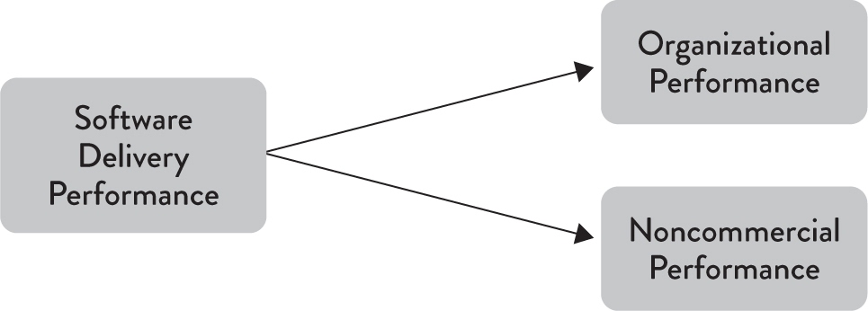

Delivery Lead Time + Deployment Frequency = Quantity Metrics (Tempo)

Time to Restore Service + Change Fail Rate = Quality Metrics (Stability)

## Delivery Lead Time
> the time it takes to go from code committed to code successfully running in production
> Shorter is better
> measurement: from < 1 hour to more than six months

## Deployment Frequency 
a software deployment to production or to an app store.
> measurement: from on demand to fewer than once every six months

## Mean Time to Restore (MTTR))
> How quickly can service be restored?
> measurement: from < 1 hour to more than six months

## Change Failure Rate (CFR)
> percentage of changes for the primary application or service they work on either result in degraded service or subsequently require remediation 

----

High Performers
> On demand deployment frequency
> Less than one hour deliver lead time
> MTTR: < 1 hour
> CFR: 0 - 15%

there is no tradeoff between improving performance and achieving higher levels of stability and quality

## Delivery Performance Impact on Org Performance

> high-performing organizations were consistently twice as likely to exceed these goals as low performers.
> high performers were also twice as likely to exceed objectives in quantity of goods and services, operating efficiency, customer satisfaction, quality of products or services, and achieving organization or mission goals.

delivery performance matters provides a strong argument against outsourcing the development of software that is strategic to your business

*In organizations with a learning culture, they are incredibly powerful.*

----

culture levels
1. interpretations: things people just "know"
2. values
3. artifacts: visible items like mission statements, procedures, etc 

Good information flow is critical to the safe and effective operation of high-tempo and high-consequence environments
- provides answers to the questions that the receiver needs answered
- timely
- presented in such a way that it can be effectively used by the receiver

best culture
> safe to deliver bad news
> high cooperation
> shared risk and responsibility
> cross functional collab encouraged
> failures are studied and means room for improvement

---

to implement continuous delivery
> It should be possible to provision our environments and build, test, and deploy our software in a fully automated fashion purely from information stored in version control
> keep branches short-lived 
> Automated unit and acceptance tests should be run against every commit

when developers are involved in creating and maintaining acceptance tests, there are two important effects
> code becomes more testable when developers write tests
> developers are responsible for the automated tests, they care more about them and will invest more effort into maintaining and fixing them