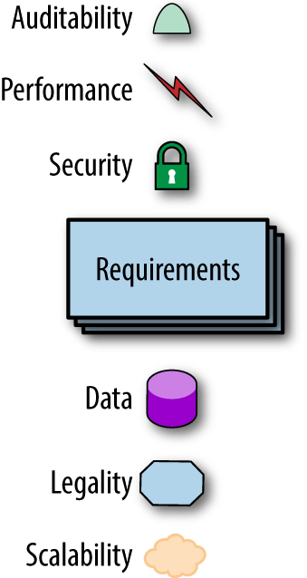
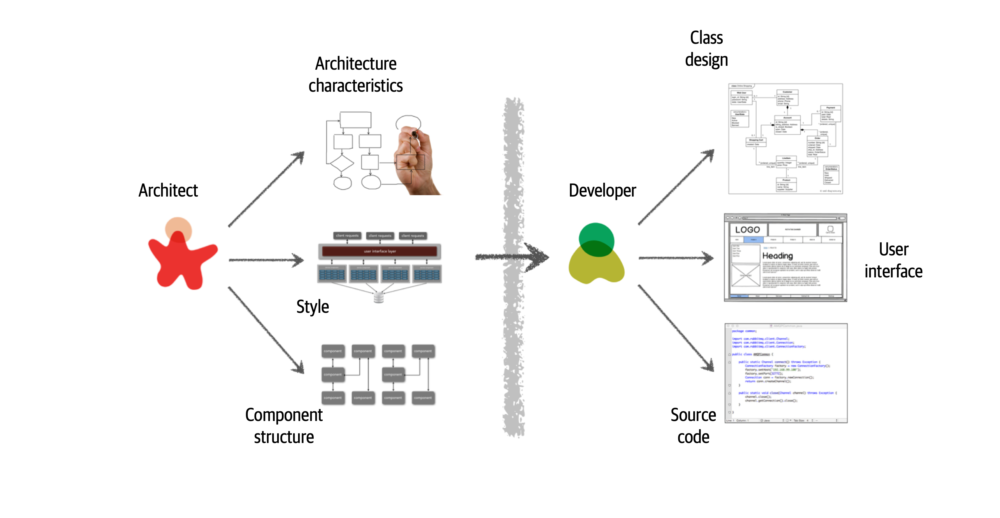
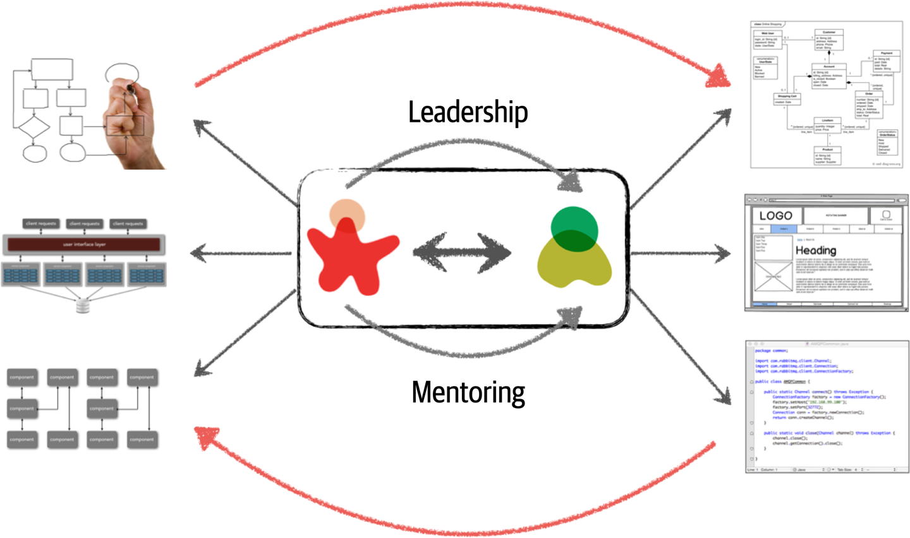
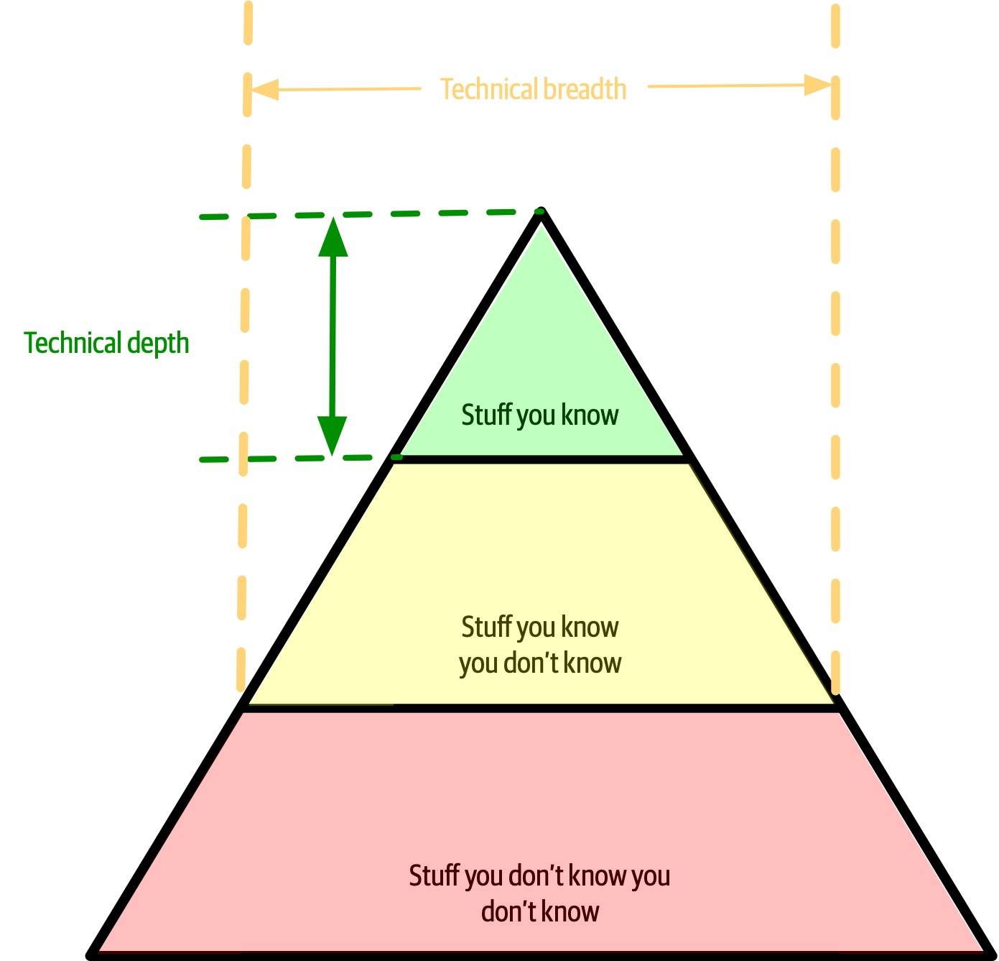

### eight core expectations of software architects

1. Make architecture decisions
   * define the architecture decisions and design principles
   * An architect should guide rather than specify technology choices.
2. Continually analyze the architecture
   * recommend solutions for improvement
   * holistically analyze changes in technology and problem domains to determine the soundness of the architecture.
3. Keep current with latest trends
   * decisions an architect makes tend to be long-lasting and difficult to change. 
   * https://www.thoughtworks.com/radar
4. Ensure compliance with decisions
   * continually verifying that development teams are following the architecture decisions and design principles defined, documented, and communicated by the architect.
   * compliance using automated fitness functions and automated tools.
5. Diverse exposure and experience
   * stretch comfort zone
   * should be aggressive in seeking out opportunities to gain experience in multiple languages, platforms, and technologies.
6. Have business domain knowledge
   *  Without business domain knowledge, it is difficult to design an effective architecture to meet the requirements of the business.
   *  creates a strong level of confidence that the software architect knows what they are doing and is competent to create an effective and correct architecture.
7. Possess interpersonal skills
   * provide technical guidance to the team
   *  lead the development teams through the implementation of the architecture.
8. Understand and navigate politics
   *  almost every decision an architect makes will be challenged
   *   navigate the politics of the company and apply basic negotiation skills to get most decisions approved.

Unknown unknowns are the nemesis of software systems. 
> architects cannot design for unknown unknowns.

a microservices architecture assumes 
- automated machine provisioning, 
- automated testing and deployment

### Build Evolutionary Architecture
architectural fitness functions: an objective integrity assessment of some architectural characteristic(s).

**First Law of Software Architecture**
> Everything in software architecture is a trade-off.
*Corollary 1*
> If an architect thinks they have discovered something that isn’t a trade-off, more likely they just haven’t identified the trade-off yet.

**Second Law of Software Architecture:**
> Why is more important than how.

-----

## Architectural Thinking

### 1. Understanding the difference between architecture and design and knowing how to collaborate with development teams to make architecture work

architect is responsible for things like 
* analyzing business requirements 
* extract and define the architectural characteristics
* selecting which architecture patterns and styles would fit the problem domain
* creating components 

development team is responsible for
* creating class diagrams for each component
* creating user interface screens
* developing
* testing source code

 VS 

 

 architect and developer must be on the same virtual team to make this work

 ### 2. A wide breadth of technical knowledge while still maintaining a certain level of technical depth

 

 two common dysfunctions
 1. architect tries to maintain expertise in a wide variety of areas, succeeding in none of them and working themselves ragged in the process
 2. stale expertise—the mistaken sensation that your outdated information is still cutting edge

### 3. Understanding, analyzing, and reconciling trade-offs between various solutions and technologies

everything in software architecture has a trade-off: an advantage and disadvantage.

Architecture is the stuff you can’t Google

a software architect would analyze the negatives of the topic solution
> asking “which is more important?"

### 4. Understanding the importance of business drivers and how they translate to architectural concerns

> business drivers that are required for the success of the system and translating those requirements into architecture characteristics (such as scalability, performance, and availability)

+ some level of business domain knowledge and healthy, 
+ collaborative relationships with key business stakeholders

### Hands-On Coding

every architect should code and be able to maintain a certain level of technical depth

+ delegate the critical path and framework code to others
+ focus on coding a piece of business functionality (a service or a screen) one to three iterations down the road
+ better able to identify with the development team in terms of the pain they might be going through with processes

**how to keep Practicing coding**
1. do frequent proof-of-concepts or POCs. write the best production-quality code
2. tackle some of the technical debt stories or architecture stories
3. working on bug fixes within an iteration
4. creating simple command-line tools and analyzers to help the development team with their day-to-day tasks 
5. do frequent code reviews