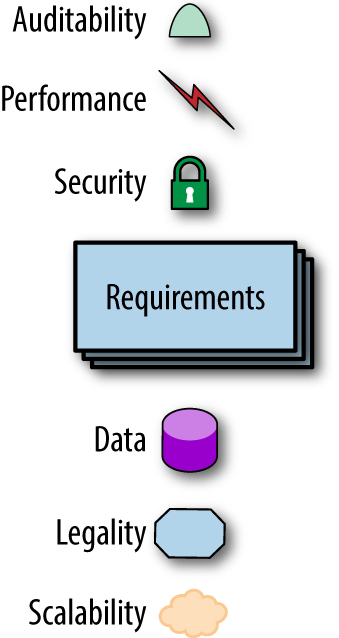
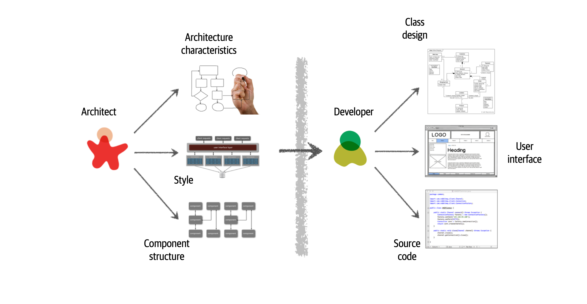
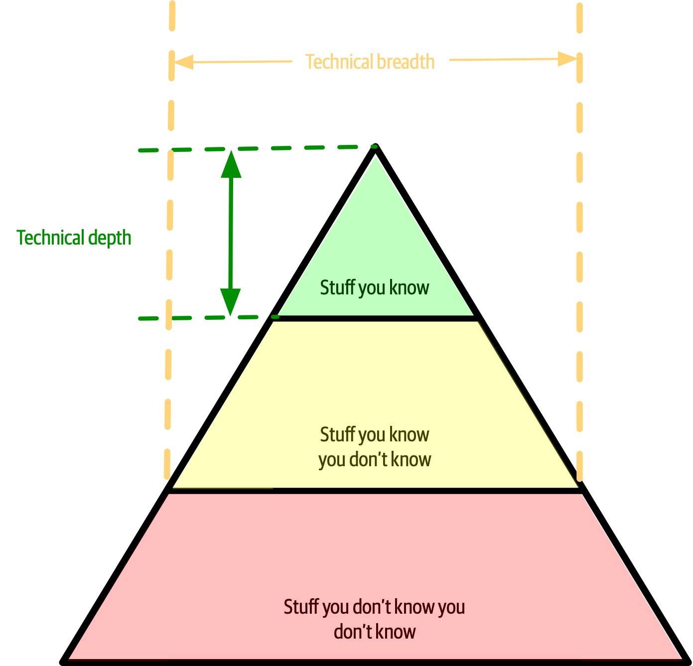
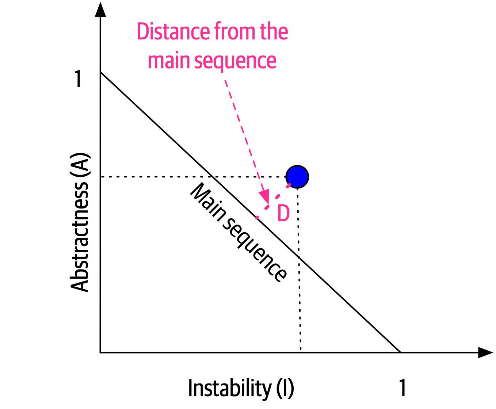
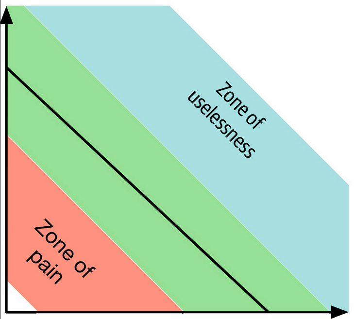
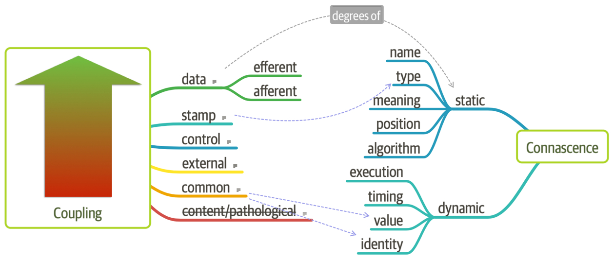
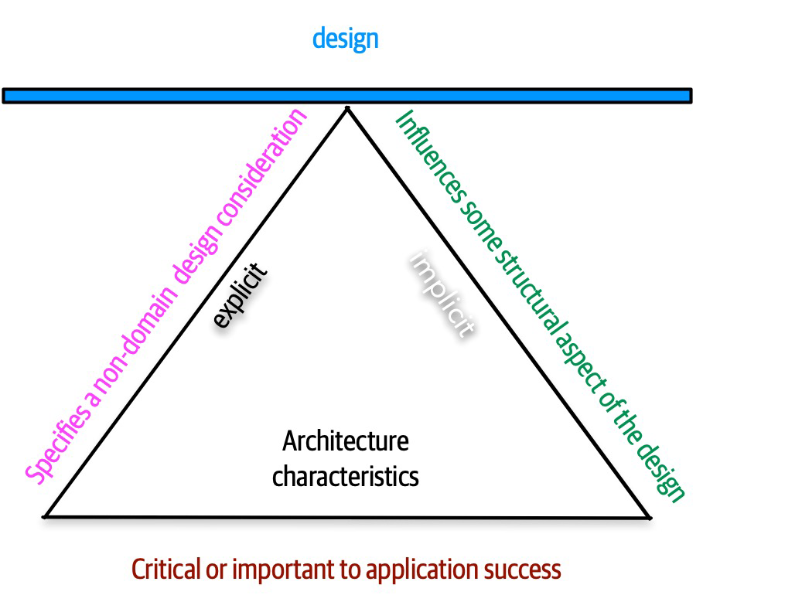
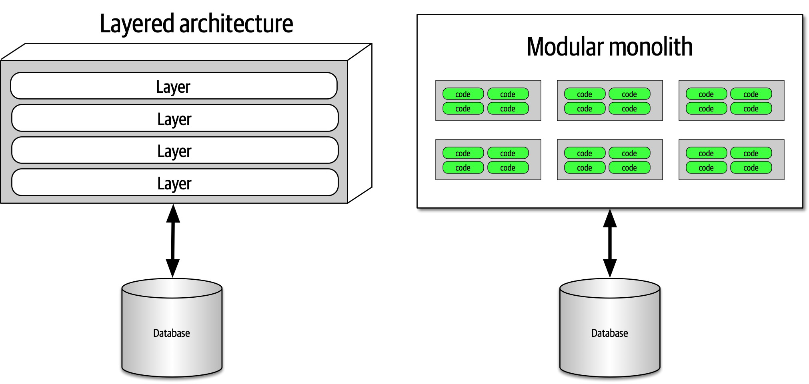
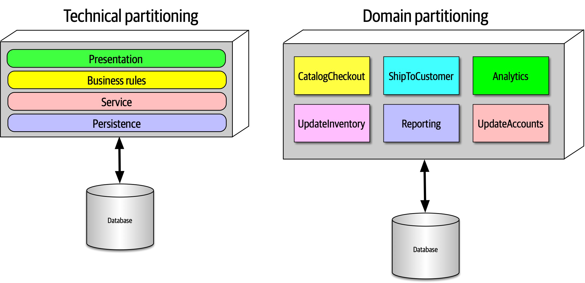

# The Fundamentals of Software Architecture

### eight core expectations of software architects

1. Make architecture decisions
   * define the architecture decisions and design principles
   * An architect should guide rather than specify technology choices.
2. Continually analyze the architecture
   * recommend solutions for improvement
   * holistically analyze changes in technology and problem domains to determine the soundness of the architecture.
3. Keep current with latest trends
   * decisions an architect makes tend to be long-lasting and difficult to change. 
   * https://www.thoughtworks.com/radar
4. Ensure compliance with decisions
   * continually verifying that development teams are following the architecture decisions and design principles defined, documented, and communicated by the architect.
   * compliance using automated fitness functions and automated tools.
5. Diverse exposure and experience
   * stretch comfort zone
   * should be aggressive in seeking out opportunities to gain experience in multiple languages, platforms, and technologies.
6. Have business domain knowledge
   *  Without business domain knowledge, it is difficult to design an effective architecture to meet the requirements of the business.
   *  creates a strong level of confidence that the software architect knows what they are doing and is competent to create an effective and correct architecture.
7. Possess interpersonal skills
   * provide technical guidance to the team
   *  lead the development teams through the implementation of the architecture.
8. Understand and navigate politics
   *  almost every decision an architect makes will be challenged
   *   navigate the politics of the company and apply basic negotiation skills to get most decisions approved.

Unknown unknowns are the nemesis of software systems. 
> architects cannot design for unknown unknowns.

a microservices architecture assumes 
- automated machine provisioning, 
- automated testing and deployment

### Build Evolutionary Architecture
architectural fitness functions: an objective integrity assessment of some architectural characteristic(s).

**First Law of Software Architecture**
> Everything in software architecture is a trade-off.
*Corollary 1*
> If an architect thinks they have discovered something that isn’t a trade-off, more likely they just haven’t identified the trade-off yet.

**Second Law of Software Architecture:**
> Why is more important than how.

-----

## Architectural Thinking

### 1. Understanding the difference between architecture and design and knowing how to collaborate with development teams to make architecture work

architect is responsible for things like 
* analyzing business requirements 
* extract and define the architectural characteristics
* selecting which architecture patterns and styles would fit the problem domain
* creating components 

development team is responsible for
* creating class diagrams for each component
* creating user interface screens
* developing
* testing source code

 VS 

 

 architect and developer must be on the same virtual team to make this work

 ### 2. A wide breadth of technical knowledge while still maintaining a certain level of technical depth

 

 two common dysfunctions
 1. architect tries to maintain expertise in a wide variety of areas, succeeding in none of them and working themselves ragged in the process
 2. stale expertise—the mistaken sensation that your outdated information is still cutting edge

### 3. Understanding, analyzing, and reconciling trade-offs between various solutions and technologies

everything in software architecture has a trade-off: an advantage and disadvantage.

Architecture is the stuff you can’t Google

a software architect would analyze the negatives of the topic solution
> asking “which is more important?"

### 4. Understanding the importance of business drivers and how they translate to architectural concerns

> business drivers that are required for the success of the system and translating those requirements into architecture characteristics (such as scalability, performance, and availability)

+ some level of business domain knowledge and healthy, 
+ collaborative relationships with key business stakeholders

### Hands-On Coding

every architect should code and be able to maintain a certain level of technical depth

+ delegate the critical path and framework code to others
+ focus on coding a piece of business functionality (a service or a screen) one to three iterations down the road
+ better able to identify with the development team in terms of the pain they might be going through with processes

**how to keep Practicing coding**
1. do frequent proof-of-concepts or POCs. write the best production-quality code
2. tackle some of the technical debt stories or architecture stories
3. working on bug fixes within an iteration
4. creating simple command-line tools and analyzers to help the development team with their day-to-day tasks 
5. do frequent code reviews

----

module
> a related grouping of code: classes, functions, or any other grouping
> doesn’t imply a physical separation, merely a logical one

### Cohesion
> a measure of how related the parts are to one another

Attempting to divide a cohesive module would only result in increased coupling and decreased readability.

* Functional cohesion: Every part of the module is related to the other, and the module contains everything essential to function. ex. basic functions, methods
* Sequential cohesion: Two modules interact, where one outputs data that becomes the input for the other. ex. form processing
* Communicational cohesion: Two modules form a communication chain, where each operates on information and/or contributes to some output. ex. notifications
* Procedural cohesion: Two modules must execute code in a particular order. ex. business logic
* Temporal cohesion: Modules are related based on timing dependencies. ex. loading settings
* Logical cohesion: The data within modules is related logically but not functionally.  ex. format conversion
* Coincidental cohesion: Elements in a module are not related other than being in the same source file; this represents the most negative form of cohesion.

How to decide cohesiveness of a module:
1. Split a module if there is a chance each part will grow. Combine otherwise.
2. Split if there is not data-dependencies between the two
3. Split if they do not fulfill any of the cohesion criteria above.
  
**Lack of Cohesion in Methods (LCOM)**
> The sum of sets of methods not shared via sharing fields
> lower value, better

### Coupling
> lower value, better

Afferent coupling / incoming coupling
> number of incoming connections to a code artifact (component, class, function, and so on)

Efferent coupling / outgoing coupling
> outgoing connections to other code artifacts.

**Abstractness**
ratio of abstract artifacts (abstract classes, interfaces, and so on) to concrete artifacts (implementation)
> number of functions / abstractions in a code base.
> more abstractions, more difficulty understanding the connections

**Instability**
> ratio of efferent coupling to the sum of both efferent and afferent coupling
> A code base that exhibits high degrees of instability breaks more easily when changed because of high coupling.
> too many function calls means the caller can become unstable if the called functions change

**Distance from the Main Sequence**
> shorter distance, better

> code that is too abstract becomes difficult to use
> code with too much implementation and not enough abstraction becomes brittle and hard to maintain

### Connascence

> Two components are connascent if a change in one would require the other to be modified in order to maintain the overall correctness of the system.
> Lower connascence, better

**Static connascence**
> source-code-level coupling

* Connascence of Name (CoN): Multiple components must agree on the name of an entity. ex. consistent naming of functions using verbObject casing.
* Connascence of Type (CoT): Multiple components must agree on the type of an entity. ex. limiting variables to a type like Typescript
* Connascence of Meaning (CoM) or Connascence of Convention (CoC): Multiple components must agree on the meaning of particular values. ex. definitions of meanings of int values, ex  ORDERED = 1, CANCELLED = -1, etc
* Connascence of Position (CoP): Multiple entities must agree on the order of values. ex. correct ordering of parameters fn(a, b, c) 
* Connascence of Algorithm (CoA): Multiple components must agree on a particular algorithm. ex. using zxcvbn for password checking.

**Dynamic connascence**
> coupling during runtime

Connascence of Execution (CoE): The order of execution of multiple components is important. ex. saving to db before getting the insertId
Connascence of Timing (CoT): The timing of the execution of multiple components is important. ex. race conditions, ex APIs that depend on other APIs.
Connascence of Values (CoV): Occurs when several values relate on one another and must change together. ex. changing one's city usually means also changing the street and town
Connascence of Identity (CoI): Occurs when several values must reference the same entity.

**Connascence properties**

1. **strength** of connascence by the ease with which a developer can refactor that type of coupling
> Architects should prefer static connascence to dynamic

2. **locality** of connascence measures how proximal the modules are to each other
> poor coupling when far apart are fine when closer together

Stronger forms of connascence found within the same module represent less code smell than the same connascence spread apart

**Rule of Locality**: as the distance between software elements increases, use weaker forms of connascence

3. **degree** of connascence relates to the size of its impact—does it impact a few classes or many?
> Lesser degrees of connascence damage code bases less.

**Rule of Degree**: convert strong forms of connascence into weaker forms of connascence

### using connascence to improve systems modularity

1. Minimize overall connascence by breaking the system into encapsulated elements
2. Minimize any remaining connascence that crosses encapsulation boundaries
3. Maximize the connascence within encapsulation boundaries

Structured programming only cares about in or out, whereas connascence cares about how things are coupled together

----

## Architecture Characteristics

Criteria
* Specifies a nondomain design consideration
* Influences some structural aspect of the design
* Is critical or important to application success

*Specifies a nondomain design consideration*
> architecture characteristics specify operational and design criteria for success
> ex. performance levels, level of technical debt, 

*Influences some structural aspect of the design*
> does this architecture characteristic require special structural consideration to succeed?
> ex. security levels for payments

*Critical or important to application success*
> choosing the fewest architecture characteristics rather than the most possible

**implicit**
> rarely appear in requirements, yet they’re necessary for project success
> ex.  availability, reliability, and security
> Architects must use their knowledge of the problem domain to uncover these

**explicit**
> shows up in requirements

### Operational Architecture Characteristics
> Operational architecture characteristics heavily overlap with operations and DevOps
+ Availability
+ Performance
+ Continuity
+ Recoverability
+ Reliability/safety
+ Robustness
+ Scalability

### Structural Architecture Characteristics
+ Configurability
+ Extensibility
+ Installability
+ Leverageability/reuse
+ Localization
+ Maintainability
+ Portability
+ Supportability
+ Upgradeability
	
### Cross-Cutting Architecture Characteristics
+ Accessibility
+ Archivability
+ Authentication
+ Authorization
+ Legal
+ Privacy
+ Security
+ Supportability
+ Usability/achievability

### Trade-Offs and Least Worst Architecture
+ More often, the decisions come down to trade-offs between several competing concerns.
+ Never shoot for the best architecture, but rather the least worst architecture.
+ If you can make changes to the architecture more easily, you can stress less about discovering the exact correct thing in the first attempt. 

----

## Extracting Architecture Characteristics from Domain Concerns

1. keep the final list as short as possible.
> supporting too many architecture characteristics leads to greater and greater complexity 
2. have the domain stakeholders select the top three most important characteristics from the final list (in any order)

Most architecture characteristics come from listening to key domain stakeholders and collaborating with them to determine what is important from a domain perspective.

*See page 84 for table for translation between business and arch jargon*

## Extracting Architecture Characteristics from Requirements

### Architecture Katas

sections
1. **Description**: The overall domain problem the system is trying to solve
2. **Users**: The expected number and/or types of users of the system
3. **Requirements**: Domain/domain-level requirements, as an architect might expect from domain users/domain experts
4. **Additional context**: Many of the considerations an architect must make aren’t explicitly expressed in requirements but rather by implicit knowledge of the problem domain

Generally, architects are more likely to cull the explicit architecture characteristics, as many of the implicit ones support general success.

----

## Measuring and Governing Architecture Characteristics

Rather than set an arbitrary number as the goal, engineers measure the scale over time and build statistical models, then raise alarms if the real-time metrics fall outside the prediction models.

### Cyclomatic Complexity
> Uses the fewest decisions to do the job. Its decision tree should be easy to navigate.
> For example, if a function has no decision statements (such as if statements), then CC = 1. If the function had a single conditional, then CC = 2 because two possible execution paths exist.
> under 10 is acceptable, would prefer code to fall under five

### Governance and Fitness Functions

> As the name implies, the scope of architecture governance covers any aspect of the software development process that architects (including roles like enterprise architects) want to exert an influence upon.
> fitness function: an object function used to assess how close the output comes to achieving the aim

Architecture fitness function
> Any mechanism that provides an objective integrity assessment of some architecture characteristic or combination of architecture characteristics

Cyclic dependencies
> use tools to find these in code: JDepend, JUnit, Simian Army, etc

Distance from the main sequence

Architects must ensure that developers understand the purpose of the fitness function before imposing it on them.

Chaos engineering offers an interesting new perspective on architecture: it’s not a question of if something will eventually break, but when. Anticipating those breakages and tests to prevent them makes systems much more robust.

----

no matter how much an architect puts effort into designing a performant or elastic code base, if the system uses a database that doesn’t match those characteristics, the application won’t be successful.

## Architecture quantum
> An independently deployable artifact with high functional cohesion and synchronous connascence
+ **Independently deployable**: includes all the necessary components to function independently from other parts of the architecture
+ **High functional cohesion**: implies that an architecture quantum does something purposeful.
+ **Synchronous connascence**: implies synchronous calls within an application context or between distributed services that form this architecture quantum

Connascence
> Two components are connascent if a change in one would require the other to be modified in order to maintain the overall correctness of the system

statically connascence
> changing the shared class requires changes to both services

dynamic connascence
> synchronous and asynchronous (as in like in JS)

In modern systems, architects define architecture characteristics at the quantum level rather than system level

----

We call physical packaging of modules **components**.
+ composer packages
+ ruby gems
+ npm packages
+ libraries

**top-level partitioning**

1. layered monolith
2. modular monolith

**technical partitioning.**
>  presentation, business rules, services, persistence, etc
> Model-View-Controller design
+ customization code is separated
+ layered arch
- Higher degree of global coupling

**domain partitioning**
> microservices
> partitions the architecture around domains or workflows rather than technical capabilities.
+ closer to how business works
+ crossfunctional teams
+ modular monolith / microservices
+ easy migration
- custom code duplicated

**Conway’s Law**
> Organizations which design systems … are constrained to produce designs which are copies of the communication structures of these organizations.

**Actor/Actions approach**
> identify actors who perform activities with the application and the actions those actors may perform. 

**Event storming**
> assumes the project will use messages and/or events to communicate between the various components.

**Workflow approach**
> models the components around workflows.
> identifies the key roles, determines the kinds of workflows these roles engage in, and builds components around the identified activities.

*should the architecture be monolithic or distributed?*

