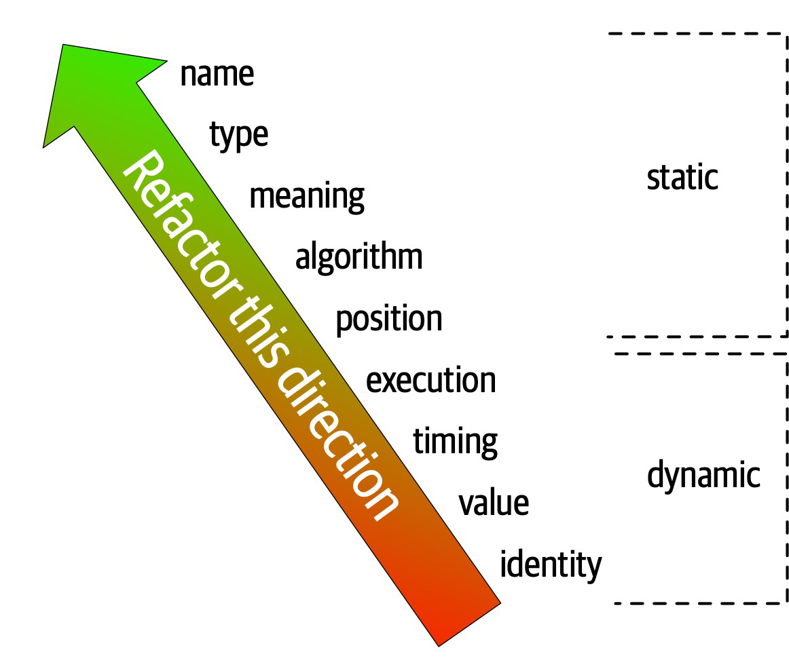

# The Fundamentals of Software Architecture

### eight core expectations of software architects

1. Make architecture decisions
   * define the architecture decisions and design principles
   * An architect should guide rather than specify technology choices.
2. Continually analyze the architecture
   * recommend solutions for improvement
   * holistically analyze changes in technology and problem domains to determine the soundness of the architecture.
3. Keep current with latest trends
   * decisions an architect makes tend to be long-lasting and difficult to change. 
   * https://www.thoughtworks.com/radar
4. Ensure compliance with decisions
   * continually verifying that development teams are following the architecture decisions and design principles defined, documented, and communicated by the architect.
   * compliance using automated fitness functions and automated tools.
5. Diverse exposure and experience
   * stretch comfort zone
   * should be aggressive in seeking out opportunities to gain experience in multiple languages, platforms, and technologies.
6. Have business domain knowledge
   *  Without business domain knowledge, it is difficult to design an effective architecture to meet the requirements of the business.
   *  creates a strong level of confidence that the software architect knows what they are doing and is competent to create an effective and correct architecture.
7. Possess interpersonal skills
   * provide technical guidance to the team
   *  lead the development teams through the implementation of the architecture.
8. Understand and navigate politics
   *  almost every decision an architect makes will be challenged
   *   navigate the politics of the company and apply basic negotiation skills to get most decisions approved.

Unknown unknowns are the nemesis of software systems. 
> architects cannot design for unknown unknowns.

a microservices architecture assumes 
- automated machine provisioning, 
- automated testing and deployment

### Build Evolutionary Architecture
architectural fitness functions: an objective integrity assessment of some architectural characteristic(s).

**First Law of Software Architecture**
> Everything in software architecture is a trade-off.
*Corollary 1*
> If an architect thinks they have discovered something that isn’t a trade-off, more likely they just haven’t identified the trade-off yet.

**Second Law of Software Architecture:**
> Why is more important than how.

-----

## Architectural Thinking

### 1. Understanding the difference between architecture and design and knowing how to collaborate with development teams to make architecture work

architect is responsible for things like 
* analyzing business requirements 
* extract and define the architectural characteristics
* selecting which architecture patterns and styles would fit the problem domain
* creating components 

development team is responsible for
* creating class diagrams for each component
* creating user interface screens
* developing
* testing source code

 VS 

 

 architect and developer must be on the same virtual team to make this work

 ### 2. A wide breadth of technical knowledge while still maintaining a certain level of technical depth

 

 two common dysfunctions
 1. architect tries to maintain expertise in a wide variety of areas, succeeding in none of them and working themselves ragged in the process
 2. stale expertise—the mistaken sensation that your outdated information is still cutting edge

### 3. Understanding, analyzing, and reconciling trade-offs between various solutions and technologies

everything in software architecture has a trade-off: an advantage and disadvantage.

Architecture is the stuff you can’t Google

a software architect would analyze the negatives of the topic solution
> asking “which is more important?"

### 4. Understanding the importance of business drivers and how they translate to architectural concerns

> business drivers that are required for the success of the system and translating those requirements into architecture characteristics (such as scalability, performance, and availability)

+ some level of business domain knowledge and healthy, 
+ collaborative relationships with key business stakeholders

### Hands-On Coding

every architect should code and be able to maintain a certain level of technical depth

+ delegate the critical path and framework code to others
+ focus on coding a piece of business functionality (a service or a screen) one to three iterations down the road
+ better able to identify with the development team in terms of the pain they might be going through with processes

**how to keep Practicing coding**
1. do frequent proof-of-concepts or POCs. write the best production-quality code
2. tackle some of the technical debt stories or architecture stories
3. working on bug fixes within an iteration
4. creating simple command-line tools and analyzers to help the development team with their day-to-day tasks 
5. do frequent code reviews

----

module
> a related grouping of code: classes, functions, or any other grouping
> doesn’t imply a physical separation, merely a logical one

### Cohesion
> a measure of how related the parts are to one another

Attempting to divide a cohesive module would only result in increased coupling and decreased readability.

* Functional cohesion: Every part of the module is related to the other, and the module contains everything essential to function. ex. basic functions, methods
* Sequential cohesion: Two modules interact, where one outputs data that becomes the input for the other. ex. form processing
* Communicational cohesion: Two modules form a communication chain, where each operates on information and/or contributes to some output. ex. notifications
* Procedural cohesion: Two modules must execute code in a particular order. ex. business logic
* Temporal cohesion: Modules are related based on timing dependencies. ex. loading settings
* Logical cohesion: The data within modules is related logically but not functionally.  ex. format conversion
* Coincidental cohesion: Elements in a module are not related other than being in the same source file; this represents the most negative form of cohesion.

How to decide cohesiveness of a module:
1. Split a module if there is a chance each part will grow. Combine otherwise.
2. Split if there is not data-dependencies between the two
3. Split if they do not fulfill any of the cohesion criteria above.
  
**Lack of Cohesion in Methods (LCOM)**
> The sum of sets of methods not shared via sharing fields
> lower value, better

### Coupling
> lower value, better

Afferent coupling / incoming coupling
> number of incoming connections to a code artifact (component, class, function, and so on)

Efferent coupling / outgoing coupling
> outgoing connections to other code artifacts.

**Abstractness**
ratio of abstract artifacts (abstract classes, interfaces, and so on) to concrete artifacts (implementation)
> number of functions / abstractions in a code base.
> more abstractions, more difficulty understanding the connections

**Instability**
> ratio of efferent coupling to the sum of both efferent and afferent coupling
> A code base that exhibits high degrees of instability breaks more easily when changed because of high coupling.
> too many function calls means the caller can become unstable if the called functions change

**Distance from the Main Sequence**
> shorter distance, better

> code that is too abstract becomes difficult to use
> code with too much implementation and not enough abstraction becomes brittle and hard to maintain

### Connascence

> Two components are connascent if a change in one would require the other to be modified in order to maintain the overall correctness of the system.
> Lower connascence, better

**Static connascence**
> source-code-level coupling

* Connascence of Name (CoN): Multiple components must agree on the name of an entity. ex. consistent naming of functions using verbObject casing.
* Connascence of Type (CoT): Multiple components must agree on the type of an entity. ex. limiting variables to a type like Typescript
* Connascence of Meaning (CoM) or Connascence of Convention (CoC): Multiple components must agree on the meaning of particular values. ex. definitions of meanings of int values, ex  ORDERED = 1, CANCELLED = -1, etc
* Connascence of Position (CoP): Multiple entities must agree on the order of values. ex. correct ordering of parameters fn(a, b, c) 
* Connascence of Algorithm (CoA): Multiple components must agree on a particular algorithm. ex. using zxcvbn for password checking.

**Dynamic connascence**
> coupling during runtime

Connascence of Execution (CoE): The order of execution of multiple components is important. ex. saving to db before getting the insertId
Connascence of Timing (CoT): The timing of the execution of multiple components is important. ex. race conditions, ex APIs that depend on other APIs.
Connascence of Values (CoV): Occurs when several values relate on one another and must change together. ex. changing one's city usually means also changing the street and town
Connascence of Identity (CoI): Occurs when several values must reference the same entity.

**Connascence properties**

1. **strength** of connascence by the ease with which a developer can refactor that type of coupling
> Architects should prefer static connascence to dynamic

2. **locality** of connascence measures how proximal the modules are to each other
> poor coupling when far apart are fine when closer together

Stronger forms of connascence found within the same module represent less code smell than the same connascence spread apart

**Rule of Locality**: as the distance between software elements increases, use weaker forms of connascence

3. **degree** of connascence relates to the size of its impact—does it impact a few classes or many?
> Lesser degrees of connascence damage code bases less.

**Rule of Degree**: convert strong forms of connascence into weaker forms of connascence

### using connascence to improve systems modularity

1. Minimize overall connascence by breaking the system into encapsulated elements
2. Minimize any remaining connascence that crosses encapsulation boundaries
3. Maximize the connascence within encapsulation boundaries

Structured programming only cares about in or out, whereas connascence cares about how things are coupled together

----

## Architecture Characteristics

Criteria
* Specifies a nondomain design consideration
* Influences some structural aspect of the design
* Is critical or important to application success

*Specifies a nondomain design consideration*
> architecture characteristics specify operational and design criteria for success
> ex. performance levels, level of technical debt, 

*Influences some structural aspect of the design*
> does this architecture characteristic require special structural consideration to succeed?
> ex. security levels for payments

*Critical or important to application success*
> choosing the fewest architecture characteristics rather than the most possible

**implicit**
> rarely appear in requirements, yet they’re necessary for project success
> ex.  availability, reliability, and security
> Architects must use their knowledge of the problem domain to uncover these

**explicit**
> shows up in requirements

### Operational Architecture Characteristics
> Operational architecture characteristics heavily overlap with operations and DevOps
+ Availability
+ Performance
+ Continuity
+ Recoverability
+ Reliability/safety
+ Robustness
+ Scalability

### Structural Architecture Characteristics
+ Configurability
+ Extensibility
+ Installability
+ Leverageability/reuse
+ Localization
+ Maintainability
+ Portability
+ Supportability
+ Upgradeability
	
### Cross-Cutting Architecture Characteristics
+ Accessibility
+ Archivability
+ Authentication
+ Authorization
+ Legal
+ Privacy
+ Security
+ Supportability
+ Usability/achievability

### Trade-Offs and Least Worst Architecture
+ More often, the decisions come down to trade-offs between several competing concerns.
+ Never shoot for the best architecture, but rather the least worst architecture.
+ If you can make changes to the architecture more easily, you can stress less about discovering the exact correct thing in the first attempt. 

----

## Extracting Architecture Characteristics from Domain Concerns

1. keep the final list as short as possible.
> supporting too many architecture characteristics leads to greater and greater complexity 
2. have the domain stakeholders select the top three most important characteristics from the final list (in any order)

Most architecture characteristics come from listening to key domain stakeholders and collaborating with them to determine what is important from a domain perspective.

*See page 84 for table for translation between business and arch jargon*

## Extracting Architecture Characteristics from Requirements

### Architecture Katas

sections
1. **Description**: The overall domain problem the system is trying to solve
2. **Users**: The expected number and/or types of users of the system
3. **Requirements**: Domain/domain-level requirements, as an architect might expect from domain users/domain experts
4. **Additional context**: Many of the considerations an architect must make aren’t explicitly expressed in requirements but rather by implicit knowledge of the problem domain

Generally, architects are more likely to cull the explicit architecture characteristics, as many of the implicit ones support general success.

----

## Measuring and Governing Architecture Characteristics

Rather than set an arbitrary number as the goal, engineers measure the scale over time and build statistical models, then raise alarms if the real-time metrics fall outside the prediction models.

### Cyclomatic Complexity
> Uses the fewest decisions to do the job. Its decision tree should be easy to navigate.
> For example, if a function has no decision statements (such as if statements), then CC = 1. If the function had a single conditional, then CC = 2 because two possible execution paths exist.
> under 10 is acceptable, would prefer code to fall under five

### Governance and Fitness Functions

> As the name implies, the scope of architecture governance covers any aspect of the software development process that architects (including roles like enterprise architects) want to exert an influence upon.
> fitness function: an object function used to assess how close the output comes to achieving the aim

Architecture fitness function
> Any mechanism that provides an objective integrity assessment of some architecture characteristic or combination of architecture characteristics

Cyclic dependencies
> use tools to find these in code: JDepend, JUnit, Simian Army, etc

Distance from the main sequence

Architects must ensure that developers understand the purpose of the fitness function before imposing it on them.

Chaos engineering offers an interesting new perspective on architecture: it’s not a question of if something will eventually break, but when. Anticipating those breakages and tests to prevent them makes systems much more robust.

----

no matter how much an architect puts effort into designing a performant or elastic code base, if the system uses a database that doesn’t match those characteristics, the application won’t be successful.

## Architecture quantum
> An independently deployable artifact with high functional cohesion and synchronous connascence
+ **Independently deployable**: includes all the necessary components to function independently from other parts of the architecture
+ **High functional cohesion**: implies that an architecture quantum does something purposeful.
+ **Synchronous connascence**: implies synchronous calls within an application context or between distributed services that form this architecture quantum

Connascence
> Two components are connascent if a change in one would require the other to be modified in order to maintain the overall correctness of the system

statically connascence
> changing the shared class requires changes to both services

dynamic connascence
> synchronous and asynchronous (as in like in JS)

In modern systems, architects define architecture characteristics at the quantum level rather than system level

----

We call physical packaging of modules **components**.
+ composer packages
+ ruby gems
+ npm packages
+ libraries

**top-level partitioning**

1. layered monolith
2. modular monolith

**technical partitioning.**
>  presentation, business rules, services, persistence, etc
> Model-View-Controller design
+ customization code is separated
+ layered arch
- Higher degree of global coupling

**domain partitioning**
> microservices
> partitions the architecture around domains or workflows rather than technical capabilities.
+ closer to how business works
+ crossfunctional teams
+ modular monolith / microservices
+ easy migration
- custom code duplicated

**Conway’s Law**
> Organizations which design systems … are constrained to produce designs which are copies of the communication structures of these organizations.

**Actor/Actions approach**
> identify actors who perform activities with the application and the actions those actors may perform. 

**Event storming**
> assumes the project will use messages and/or events to communicate between the various components.

**Workflow approach**
> models the components around workflows.
> identifies the key roles, determines the kinds of workflows these roles engage in, and builds components around the identified activities.

*should the architecture be monolithic or distributed?*

----

# Part II. Architecture Styles

**architecture style** 
> the overarching structure of how the user interface and backend source code are organized
> ex. within layers of a monolithic deployment or separately deployed services

**Architecture patterns**
> lower-level design structures that help form specific solutions within an architecture style
> ex. how to achieve high scalability or high performance within a set of operations or between sets of services

**Big Ball of Mud**
> a haphazardly structured, sprawling, sloppy, duct-tape-and-baling-wire, spaghetti-code jungle

**Unitary Architecture**
> Single computer

**Client/Server**
> separates technical functionality between frontend and backend

**Desktop + database server**
> allowed presentation logic to reside on the desktop, while the more computationally intense action (both in volume and complexity) occurred on more robust database servers.

**Browser + web server**
> the web and database servers run on one class of machine within the operations center and the user interface runs on the user’s browser.

**Three-tier**
> a database tier using an industrial-strength database server, an application tier managed by an application server, frontend coded in generated HTML, and increasingly, JavaScript, as its capabilities expanded.

monolithic
> single deployment unit of all code

distributed
> multiple deployment units connected through remote access protocols
- Fallacy #1: The Network Is Reliable
- Fallacy #2: Latency Is Zero
- Fallacy #3: Bandwidth Is Infinite
- Fallacy #4: The Network Is Secure
- Fallacy #5: The Topology Never Changes
- Fallacy #6: There Is Only One Administrator
- Fallacy #7: Transport Cost Is Zero
- Fallacy #8: The Network Is Homogeneous
- Debugging is distributed and difficult to trace
- high scalability, performance, and availability at the sacrifice of data consistency and data integrity.
- Contract maintenance is particularly difficult in distributed architectures, primarily due to decoupled services and systems owned by different teams and departments

----

## Layered Architecture Style

the de facto standard for most applications, primarily because of its 
> simplicity, 
> familiarity, and 
> low cost

- falls into several architectural anti-patterns
  - architecture by implication anti-pattern
  - accidental architecture anti-pattern

organized into logical horizontal layers
consist of four standard layers: 
+ presentation: user interface and browser communication logic
+ business: business rules 
+ persistence, and 
+ database

separation of concerns 
> makes it easy to build effective roles and responsibility models 
> dealing only with the logic that pertains to that layer

 lack of overall agility (the ability to respond quickly to change)

 technically partitioned architecture
 > grouped by their technical role in the architecture

 domain-driven design approach does not work as well

 request cannot skip any layers, but rather must go through the layer immediately below it to get to the next layer

*layers of isolation*
> changes made in one layer of the architecture generally don’t impact or affect components in other layers
> becomes very brittle, as well as difficult and expensive to change.

Marking the services layer as open allows the business layer to either access that layer (as indicated by the solid arrow), or bypass the layer and go to the next one down

Failure to document or properly communicate which layers in the architecture are open and closed (and why) usually results in tightly coupled and brittle architectures that are very difficult to test, maintain, and deploy.

*architecture sinkhole anti-pattern*
> when requests move from layer to layer as simple pass-through processing with no business logic performed within each layer.
> it is acceptable if only 20 percent of the requests are sinkholes.

**Why Use This Architecture Style**
> good starting point
> for very tight budget and time constraints.
> ease of development for smaller applications
> still analyzing business needs and requirements and is unsure which architecture style would be best.

----

read on these first:
- service-based
- event-driven
- microservices

----

## Service-Based Architecture Style

distributed macro layered structure consisting of a 
> separately deployed user interface
> separately deployed remote coarse-grained services
> monolithic database.

multiple instances of a domain service can certainly exist

Domain services, being coarse-grained, allow for better data integrity and consistency

more risk with service-based architecture that something might break 

logically partition the database and manifest the logical partitioning through federated shared libraries

lock the common entity objects in the version control system and restrict change access to only the database team

Make the logical partitioning in the database as fine-grained as possible

user interface applications are federated into their respective domains

because services within a service-based architecture tend to be more coarse-grained, they don’t require coordination nearly as much as other distributed architectures.

----

## Event-Driven Architecture Style
> relies solely on asynchronous communication
> technically partitioned architecture

request-based: asks system for data or action

event-based: system responds to user activity (monitoring, ex)

### broker topology
>  used when you require a high degree of responsiveness and dynamic control over the processing of an event
> no central event mediator
> useful when you have a relatively simple event processing flow
> do not need central event orchestration and coordination
> performance and scalability

primary architecture components
1. initiating event: initial event that starts the entire event flow
2. event broker: handles event 
> federated - multiple domain-based clustered instances
3. event processor: accepts the initiating event from the event broker and begins the processing of that event
> performs a specific task associated with the processing of that event
> asynchronously advertises what it did to the rest of the system
4. processing event: asynchronously advertises what it did to the rest of the system

*asynchronous fire-and-forget broadcasting* >> pubsub

each event processor to advertise what it did to the rest of the system, regardless of whether or not any other event processor cares about what that action was.

instead of embedding functions, it emits messages which can be hooked into by listeners / functions when triggered

- Error handling is also a big challenge 
- all other processes are moving along without regard for the error.
- not possible to resubmit the initiating event

## Mediator Topology
> used when you require control over the workflow
> workflow control and error handling

architecture components
1.  initiating event
2.  event queue: collects events
3.  event mediator: only knows the steps involved in processing the event and therefore generates corresponding processing events
> multiple mediators, usually associated with a particular domain or grouping of events
> reduces the single point of failure issue
> increases overall throughput and performance
> it can maintain event state and manage error handling, recoverability, and restart capabilities
4.  event channels (queues)
5.  event processors: listen to dedicated event channels
> do not advertise what they did to the rest of the system

processing events are commands, as opposed to events
> a processing event must be processed (command), whereas it can be ignored in the broker topology (reaction).

- very difficult to declaratively model the dynamic processing that occurs within a complex event flow
- only handle the general processing
- event processors are not as highly decoupled

comes down to a trade-off between workflow control and error handling capability versus high performance and scalability.

Responsiveness is all about notifying the user that the action has been accepted and will be processed momentarily

performance is about making the end-to-end process faster

*The main issue with asynchronous communications is error handling.*

**workflow event pattern**

1.  asynchronously passes data through a message channel to the event consumer
2.   If the event consumer experiences an error while processing the data, it immediately delegates that error to the workflow processor
3.   moves on to the next message in the event queue
4.   Once the workflow processor receives an error, it tries to figure out what is wrong with the message
5.   workflow processor programmatically (without human intervention) makes changes to the original data to try and repair it
6.   ends it back to the originating queue

> messages in error are processed out of sequence when they are resubmitted

Data loss is always a primary concern when dealing with asynchronous communications.
> data loss can be mitigated through basic messaging techniques

Persisted message queues support what is known as guaranteed delivery.
> message is physically stored on disk

**client acknowledge mode**
> message is still preserved in the queue, preventing message loss in this part of the message flow.

last participant support 
> emoves the message from the persisted queue by acknowledging that processing has been completed 

capability to broadcast events without knowledge of who (if anyone) is receiving the message and what they do with it

synchronous communication is accomplished through **request-reply messaging** 
> pseudosynchronous communications

1. The initial request for information is asynchronously sent to the request queue
2. control is returned to the message producer
3. message producer then does a blocking wait on the reply queue, waiting for the response
4. message consumer receives and processes the message
5. sends the response to the reply queue
6. event producer then receives the message with the response data

*implementations*
1. use a correlation ID contained in the message header
>  set to the message ID of the original request message
2. use a temporary queue for the reply queue
> dedicated to the specific request, created when the request is made and deleted when the request ends
> much simpler
> Large messaging volumes can significantly slow down the message broker

### Hybrid Event-Driven Architectures

Adding event-driven architecture 
> helps remove bottlenecks
> provides a back pressure point in the event requests get backed up
> provides a level of user responsiveness

---

## Microservices
> heavily inspired by the ideas in domain-driven design
> distributed architecture
> prefers duplication to coupling
> microservices is firmly domain partitioned

**bounded context**
> decoupling style
> each service models a domain or workflow

 The negative trade-off of reuse is coupling

 *The primary goal of microservices is high decoupling, physically modeling the logical notion of bounded context.*

Separating each service into its own process solves all the problems brought on by sharing

Performance is often the negative side effect of the distributed nature of microservices.

The purpose of service boundaries in microservices is to capture a domain or workflow.

Guidelines
1. Ideally, each microservice should be extremely functionally cohesive, contributing one significant behavior on behalf of the overall application.
2. if architects can design their system to avoid transactions, they generate better designs.
3. If an architect builds a set of services that offer excellent domain isolation yet require extensive communication to function, the architect may consider bundling these services back into a larger service to avoid the communication overhead.

**Data Isolation**
> microservices tries to avoid all kinds of coupling, including shared schemas and databases used as integration points.

*Options:*
* either identifying one domain as the source of truth for some fact and coordinating with it to retrieve values
 using database replication or 
* caching to distribute information.

**API layer**
* should not be used as a mediator or orchestration tool
* all interesting logic in this architecture should occur inside a bounded context

**sidecar pattern**

> handles all the operational concerns that teams benefit from coupling together
> build a service mesh, allowing unified control across the architecture for concerns like logging and monitoring

 service mesh forms a console that allows teams to globally control operational coupling, such as monitoring levels, logging, and other cross-cutting operational concerns.

Architects use service discovery as a way to build elasticity into microservices architectures.

**Frontends**
 
 two styles
1. Microservices architecture with a monolithic UI
2. Microfrontends

Microservices architectures typically utilize protocol-aware heterogeneous interoperability. 
> Protocol-aware:  services must know (or discover) which protocol to use to call other services.
> Heterogeneous: supports polyglot environments, where different services use different platforms.
> Interoperability: services commonly call other services via the network to collaborate and send/receive information.

**Enforced Heterogeneity**

The goal in the microservices 
> choose the correct scale technology for the narrow scope of the problem

**Choreography**
> same communication style as a broker event-driven architecture
> no central coordinator 

Domain/architecture isomorphism
> can create their own localized mediator

common problems like error handling and coordination become more complex

the architect’s job entails finding the best way to represent that coupling in ways that support both the domain and architectural goals.

Don’t do transactions in microservices—fix granularity instead!

**Saga pattern**
> In an error condition, the mediator must ensure that no part of the transaction succeeds if one part fails. 
> use the saga pattern sparingly.

compensating transaction framework
> mediator enter a pending state until the mediator indicates overall success

do and undo for each potentially transactional operation

A few transactions across services is sometimes necessary; if it’s the dominant feature of the architecture, mistakes were made!

----
## Choosing the Appropriate Architecture Style

1. What can adapt to change?
2. What architecture fits the characteristic requirements for this domain?
3. Where should data live?
4. What architecture matches the org structure?
5. What communication styles between services—synchronous or asynchronous? 

*Use synchronous by default, asynchronous when necessary.*

----

## Architecture Decision Anti-Patterns

### Covering Your Assets
> occurs when an architect avoids or defers making an architecture decision out of fear of making the wrong choice.

to overcome:
1. wait until the last responsible moment to make an important architecture decision
   > wait until you have enough information to justify and validate your decision, but not waiting so long that you hold up development teams or fall into the Analysis Paralysis
2. continually collaborate with development teams to ensure that the decision you made can be implemented as expected

### Groundhog Day

> occurs when people don’t know why a decision was made, so it keeps getting discussed over and over and over

to overcome:
> document both technical and business justifications for your decision

If a particular architecture decision does not provide any business value, then perhaps it is not a good decision and should be reconsidered.

common business justifications:
+ cost
+ time to market
+ user satisfaction
+ strategic positioning

### Email-Driven Architecture 

> people lose, forget, or don’t even know an architecture decision has been made and therefore cannot possibly implement that architecture decision

ways to increase the effectiveness of communicating architecture decisions:
+ not include the architecture decision in the body of an email. Add it into a living document, single source of truth.
+ only notify those people who really care about the architecture decision
+ 

## architecturally significant
> decisions that affect the structure, nonfunctional characteristics, dependencies, interfaces, or construction techniques

**structure**
+ patterns or styles of architecture being used. ex sharing of data

**nonfunctional characteristics**
+ arch characteristics that are important for the application or system being developed or maintained

**dependencies**
+ coupling points between components and/or services within the system

**Interfaces**
+ how services and components are accessed and orchestrated, usually through a gateway, integration hub, service bus, or API proxy

**construction techniques**
+ platforms, frameworks, tools, and even processes that, although technical in nature, might impact some aspect of the architecture.

## Architecture Decision Records
* https://cognitect.com/blog/2011/11/15/documenting-architecture-decisions
* https://www.hascode.com/2018/05/managing-architecture-decision-records-with-adr-tools/

### Basic Structure
**Title**: short description of decision
ex. 12. Use SQS Instead of RabbitMQ

**Status**: needs approval / approved / superceded (by new ADR) / Request for Comments (draft)
> make sure to modify any superceded ADRs' status
> add a deadline if RFC
> Talk with stakeholders about cost, impact to teams, and security, which can be basis of self-approval

**Context**: why make this decision?
> what situation is forcing me to make this decision?
> include alternatives considered

**Decision**: decision description and full justification
> using a very affirmative, commanding voice
> place more emphasis on the why rather than the how

**Consequences**: impact of decision
> whether those impacts outweigh the benefits of the decision.
> document the trade-off analysis

**Compliance**: how to ensure compliance
> will it be checked manually or automated with a fitness function?

**Notes**: metadata
> orig author, approval date, approver
> superseded date

Store in git repo only if decision makers have access to it. Maybe use Google Sites.

----

## Architecture Risk

### Risk storming**
> a collaborative exercise used to determine architectural risk within a specific dimension
> Common dimensions
+ unproven technology
+ performance
+ scalability
+ availability (including transitive dependencies)
+ data loss
+ single points of failure
+ security

**Risk Matrix**
overall impact of the risk vs the likelihood of that risk occurring

**risk assessment**
> summarized report of the overall risk of an architecture with respect to some sort of contextual and meaningful assessment criteria

**Primary Activities**
> works like planning poker
1. Identification
> identifying areas of risk within the architecture
> an individual, noncollaborative activity
> Whenever possible, restrict risk storming efforts to a single dimension.
> For unproven or unknown technologies, always assign the highest risk rating (9) since the risk matrix cannot be used for this dimension.
2. Consensus
> gaining consensus among all participants regarding the risk within the architecture
> always collaborative and involve all participants working together

3. Mitigation
> usually involves changes or enhancements to certain areas of the architecture that otherwise might have been deemed perfect the way they were.
> decide whether the cost outweighs the risk

*By utilizing the same architecture risk matrix for stories, teams can identify stories of high risk, track those carefully, and prioritize them.*

----

*Careful use of representational consistency ensures that viewers understand the scope of items being presented, eliminating a common source of confusion.*

**Irrational Artifact Attachment**
> proportional relationship between a person’s irrational attachment to some artifact and how long it took to produce

## Diagramming Guidelines
1. Make sure all the elements of the diagram have titles
2. Lines should be thick enough to see well.
3. If lines indicate information flow, then use arrows to indicate directional or two-way traffic.
4. Solid lines: synchronous communication
5. Dotted lines: asynchronous communication.
6. label each item in a diagram, especially if there is any chance of ambiguity for the readers.
7. If shapes are ambiguous for any reason, include a key on the diagram clearly indicating what each shape represents.
  
**Infodecks**
> slide decks that are not meant to be projected but rather summarize information graphically, essentially using a presentation tool as a desktop publishing package.

----

## Team Building

*An architect’s role is to create the building blocks of the application (the components) and determine the interactions between those components.*

Create and communicate the constraints, or the box, in which developers can implement the architecture.
> provide the right level of guidance and constraints so that the team has the correct tools and libraries in place to effectively implement the architecture

### Control Freak
- tries to control every detailed aspect of the software development process
- usually too fine-grained and too low-level, resulting in too many constraints
- steal the art of programming away from the developers
+ works for low-skilled teams

### Armchair Architect
- hasn’t coded in a very long time (if at all) and doesn’t take the implementation details into account when creating an architecture
- disconnected from the development teams
- simply move from project to project once the initial architecture diagrams are completed
- simply in way over their head in terms of the technology or business domain
- development teams end up taking on the role of architect
- Not fully understanding the business domain, business problem, or technology used
- Not enough hands-on experience developing software
- Not considering the implications associated with the implementation of the architecture solution

biggest indicator: not having enough time to spend with the development teams implementing the architecture
> they need the architect available for answering technical or business-related questions

solution:
+ get more involved in the technology being used on the project and understanding the business problem and business domain.

### Effective software architect
+ produces the appropriate constraints and boundaries on the team
+ ensuring that the team members are working well together and have the right level of guidance on the team
+ ensures that the team has the correct and appropriate tools and technologies in place
+ remove any roadblocks that may be in the way of the development teams reaching their goals
+ requires working closely and collaborating with the team
+ gaining the respect of the team as well

### Elastic Leadership

1. Team familiarity
> the newer the team members, the more control needed
2. Team size
> more than 12 developers === big team
> 4 or fewer === small team
> The larger the team, the more control is needed
3. Overall experience
> Teams with lots of junior developers require more control
4. Project complexity
>  Highly complex projects require more control
5. Project duration
> the longer the project, the more control is needed.

For current team
1. Familiarity: +10 (some new members)
2. Size: 0 (medium sized)
3. Experience: -10 (many seniors)
4. Complexity: +20 (complex)
5. Duration: +20 (1 year at least)
TOTAL: +40, control freak-ish

**Process loss**
> frequent merge conflicts when pushing code to a repository
**Pluralistic ignorance**
> when everyone agrees to (but privately rejects) a norm because they think they are missing something obvious.
**Diffusion of responsibility**\
>  Confusion about who is responsible for what on the team and things getting dropped are good signs of a team that is too large.

## Checklists
>  The key to making teams effective is knowing when to leverage checklists and when not to.

- Any processes that have a procedural flow of dependent tasks should not be in a checklist.
- Simple, well-known processes that are executed frequently without error also do not need a checklist.

### Developer Code Completion Checklist
> useful for defining what is known as the “definition of done.”
### Unit and Functional Testing Checklist
>  contains some of the more unusual and edge-case tests that software developers tend to forget to test.
- Special characters in text and numeric fields
- Minimum and maximum value ranges
- Rate limiting, for APIs
- Error logging
- Error messages
- Failing API calls
- Auth tokens are short-lived
- Unusual and extreme test cases
- Missing fields

----

## Negotiation

1. When all else fails, state things in terms of cost and time.
2. Leverage the “divide and conquer” rule to qualify demands or requirements.
3. Always remember that demonstration defeats discussion. Show, don't tell.
4. Avoid being too argumentative or letting things get too personal in a negotiation
5. When convincing developers to adopt an architecture decision or to do a specific task, provide a justification rather than “dictating from on high.”
6. If a developer disagrees with a decision, have them arrive at the solution on their own.
7. Ask for the meeting agenda ahead of time to help qualify if you are really needed at the meeting or not.

## The 4 C’s of Architecture
> communication, collaboration, clarity, and conciseness

*accidental complexity*
> in other words, “we have made a problem hard.”

*No matter what the problem is, it’s a people problem.*

