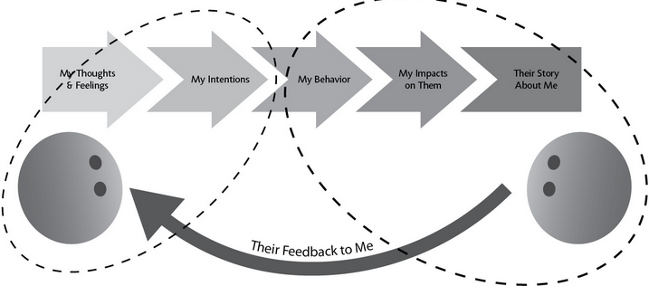

## THREE FEEDBACK TRIGGERS

1. Truth Triggers
   - set off by the substance of the feedback itself
   - it’s somehow off, unhelpful, or simply untrue
*How to receive*
  * Separate Appreciation, Coaching, and Evaluation
  * Before you figure out what to do with the feedback, make sure you understand it. ask to clarify.
  * We can’t see ourselves or hear our tone of voice. We need others to help us see ourselves, and our impact on those around us.
2. Relationship Triggers
   - tripped by the particular person who is giving us this gift of feedback.
   - based on what we believe about the giver (they’ve got no credibility on this topic!)
   - or how we feel treated by the giver (after all I’ve done for you, I get this kind of petty criticism?)
*How to receive*
  * Talk about both the feedback and the relationship issues.
  * Step back to see the relationship system between giver and receiver, and the ways you are each contributing to the problems that are prompting you to exchange feedback.
3. Identity Triggers
   - caused our identity—our sense of who we are—to come undone
   - We feel overwhelmed, threatened, ashamed, or off balance. 
*How to receive*
  * Individuals vary widely in our reactions to positive and negative feedback; extreme reactions color our sense of ourselves and our future. 
  * Work to correct distorted thinking and regain balance. 
  * We are always learning and growing. Challenge is the fastest track to growth, especially if we can sort toward coaching.

**Have a growth identity**
*  Inside a growth identity, feedback is valuable information about where one stands now and what to work on next. It is welcome input rather than upsetting verdict.

-----

**APPRECIATION**
* motivates and encourages. 
* We need evaluation to know where we stand, to set expectations, to feel reassured or secure.
* Three qualities are required for appreciation to count. 
+ it has to be specific
+ appreciation has to come in a form the receiver values and hears clearly.
+ meaningful appreciation has to be authentic
* Most needed by rank and file

**COACHING**
* helps increase knowledge, skill, capability, growth, or raises feelings in the relationship. 
* Two Needs
 + need to improve your knowledge or skills in order to build capability and meet novel challenges
 + identifying a problem in your relationship: Something is missing, something is wrong.  The “problem” the coaching is aimed at fixing is how the giver is feeling, or a perceived imbalance in the relationship.
* We need coaching to accelerate learning, to focus our time and energy where it really matters, and to keep our relationships healthy and functioning.
*  coaching can also be stressful, confusing, and ineffective
* Needed by people who want to grow their career, managers or equivalent

**EVALUATION**
* tells you where you stand, aligns expectations, and informs decision making.
* Evaluations are always in some respect comparisons, implicitly or explicitly, against others or against a particular set of standards.
* We need appreciation if all the sweat and tears we put into our jobs and our relationships are going to feel worthwhile.
* Before I can take in coaching or appreciation, I need to know that I’m where I need to be, that this relationship is going to last.
* Needed by those close to failure (PIP)
* Also needed by executives and leadership

----
## Fixes for Cross-Transactions

**GET ALIGNED: KNOW THE PURPOSE AND DISCUSS IT**
* Discuss the purpose of the feedback explicitly.
(1) What’s my purpose in giving/receiving this feedback?
(2) Is it the right purpose from my point of view?
(3) Is it the right purpose from the other person’s point of view?
* Be explicit about what you think the conversation is about, and be explicit about what would be most helpful to you. Then discuss and, if you each need something different, negotiate. 
* Remember: Explicit disagreement is better than implicit misunderstanding.

**SEPARATE EVALUATION FROM COACHING AND APPRECIATION**
* The evaluation conversation needs to take place first. 
* the evaluation conversation and the coaching conversation should be separated by at least days, and probably longer.

----

Feedback is delivered in vague labels, and we are prone to wrong spotting. 

How to give feedback
1. Be specific
   + (1) Coming from: their data and interpretations 
        - examine a key distinction: the difference between the giver’s “data” (what they observe) and their interpretation
   + (2) Going to: advice, consequences, expectations
        - difference between feedback that is coaching, which aims at advice, and feedback that is evaluation, which clarifies consequences. 

ASK WHERE THE FEEDBACK IS COMING FROM
1. Observe Data
   * whatever they’ve seen, felt, heard, smelled, touched, tasted, remembered, or read that is relevant
2. Interpret the Data
   * People don’t typically offer their raw observations as feedback, based on their own past experiences, values, assumptions, and implicit rules about the world
3. Confuse Data and Interpretation
   *  The process of moving from data to interpretation happens in the blink of an eye and is largely unconscious.
   * human intelligence is organized around stories.

ASK WHERE THE FEEDBACK IS GOING
1. When Receiving Coaching: Clarify Advice
   * If you do want to follow the advice, would you know how to do so?
   * asks how he would implement the advice if he decides to take it.
2. When Receiving Evaluation: Clarify Consequences and Expectations
   * it’s useful to have a short list of good questions in your back pocket before you walk into any evaluation conversation.

SHIFT FROM WRONG SPOTTING TO DIFFERENCE SPOTTING
* we need to understand their views even as we’re aware of our own.
* Let’s figure out why we see this differently.
  1. We have different data
  2. we interpret that data differently

> We have to consciously and persistently choose to ask about their data and share our own.

Biases Drive Data Collection
* we ascribe generally good intentions to ourselves.

> Even when you are both looking at the same data, each of you can interpret them differently.

Implicit Rules

> One of the primary reasons we interpret data differently is that we have different rules in our heads about how things should be. But we don’t think of them as our rules. We think of them as the rules.
* Organizational culture, regional culture, and even family culture are all collections of implicit rules for “how we do things around here.”
* But everyone has their own individual set as well.

ASK: WHAT’S RIGHT?
 * make a list of the ways their feedback is “right.”
 * shift around the meaning in some way that gives them the benefit of the doubt in terms of how the feedback might be helpful.

WHEN YOU STILL DISAGREE
> Your goal is to understand the feedback giver, and for them to understand you. 
> The better you understand the origins and consequences of the evaluation, the better able you are to explain why you disagree with it.

*No matter how clearly you define the criteria and the metrics, somebody has to apply the criteria to a person’s performance, and that involves making judgments.*

> The goal shouldn’t be to remove interpretation or judgment. It should be to make judgments thoughtfully, and once made, to have them be transparent and discussable.

Ask: What’s different about

    The data we are looking at
    Our interpretations and implicit rules

Ask: What’s right about the feedback to seek out what’s legit and what concerns you have in common.

Working together to get a more complete picture maximizes the chances you will (both) learn something. 

* my behavior is in your awareness and mostly not in my awareness.

Things we cannot read about ourselves:
  - facial expressions
  - tone
  - patterns of behavior

*Our blind spots are their hot spots.*

### AMPLIFIER 1: EMOTIONAL MATH
* We subtract certain emotions from the equation. But others count it double.

### AMPLIFIER 2: SITUATION VERSUS CHARACTER
* When something goes wrong and I am part of it, I will tend to attribute my actions to the situation; you will tend to attribute my actions to my character.

### AMPLIFIER 3: IMPACT VERSUS INTENT
* We judge ourselves by our intentions while others judge us by our impacts
* The “fix” is to separate intentions from impacts when feedback is discussed.

*teaching people how to invite and understand feedback—even if it feels upsetting or wrong—might help parties on both sides sort things out more successfully.*

WHAT HELPS US SEE OUR BLIND SPOTS?
> To see ourselves and our blind spots we need help from others.
> 
1.  Instead of dismissing the feedback or the person giving it to you, use these thoughts as a blind-spot alert.
2.  Ask: How am I getting in my own way? 
3.  Instead of whipping out contradictory feedback, take a breath and look for consistent feedback:
   a. consider to what extent you are each describing the same behavior but interpreting it differently
   b. look for consistencies: Ask yourself, Where have I heard this before? Is this the first time you’ve gotten such feedback, or have you heard similar things from other people (or the same exact person) over the years? 
4. If important feedback doesn’t resonate, take the whole set of questions to a friend.
* A supportive mirror shows us our best self, well rested and under flattering light.
> we often ask the people closest to us to be supportive mirrors.
* An honest mirror shows us what we look like right now, when we’re not at our best and our bedhead is bad
> People we rely on for support are often hesitant to share critical, honest feedback with us. 
> They are hesitant not out of cowardice, but out of confusion and concern.
5. For many of us, watching ourselves on video or hearing ourselves on audio is unpleasant at best. But it can be enormously illuminating, enabling us to hear our own tone and see our own behavior in ways that are normally invisible to us.
