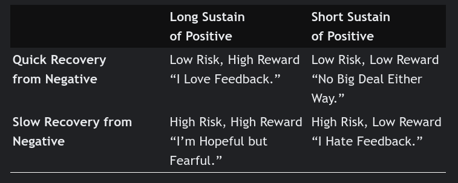

## THREE FEEDBACK TRIGGERS

1. Truth Triggers
   - set off by the substance of the feedback itself
   - it’s somehow off, unhelpful, or simply untrue
*How to receive*
  * Separate Appreciation, Coaching, and Evaluation
  * Before you figure out what to do with the feedback, make sure you understand it. ask to clarify.
  * We can’t see ourselves or hear our tone of voice. We need others to help us see ourselves, and our impact on those around us.
2. Relationship Triggers
   - tripped by the particular person who is giving us this gift of feedback.
   - based on what we believe about the giver (they’ve got no credibility on this topic!)
   - or how we feel treated by the giver (after all I’ve done for you, I get this kind of petty criticism?)
*How to receive*
  * Talk about both the feedback and the relationship issues.
  * Step back to see the relationship system between giver and receiver, and the ways you are each contributing to the problems that are prompting you to exchange feedback.
3. Identity Triggers
   - caused our identity—our sense of who we are—to come undone
   - We feel overwhelmed, threatened, ashamed, or off balance. 
*How to receive*
  * Individuals vary widely in our reactions to positive and negative feedback; extreme reactions color our sense of ourselves and our future. 
  * Work to correct distorted thinking and regain balance. 
  * We are always learning and growing. Challenge is the fastest track to growth, especially if we can sort toward coaching.

**Have a growth identity**
*  Inside a growth identity, feedback is valuable information about where one stands now and what to work on next. It is welcome input rather than upsetting verdict.

-----

**APPRECIATION**
* motivates and encourages. 
* We need evaluation to know where we stand, to set expectations, to feel reassured or secure.
* Three qualities are required for appreciation to count. 
+ it has to be specific
+ appreciation has to come in a form the receiver values and hears clearly.
+ meaningful appreciation has to be authentic
* Most needed by rank and file

**COACHING**
* helps increase knowledge, skill, capability, growth, or raises feelings in the relationship. 
* Two Needs
 + need to improve your knowledge or skills in order to build capability and meet novel challenges
 + identifying a problem in your relationship: Something is missing, something is wrong.  The “problem” the coaching is aimed at fixing is how the giver is feeling, or a perceived imbalance in the relationship.
* We need coaching to accelerate learning, to focus our time and energy where it really matters, and to keep our relationships healthy and functioning.
*  coaching can also be stressful, confusing, and ineffective
* Needed by people who want to grow their career, managers or equivalent

**EVALUATION**
* tells you where you stand, aligns expectations, and informs decision making.
* Evaluations are always in some respect comparisons, implicitly or explicitly, against others or against a particular set of standards.
* We need appreciation if all the sweat and tears we put into our jobs and our relationships are going to feel worthwhile.
* Before I can take in coaching or appreciation, I need to know that I’m where I need to be, that this relationship is going to last.
* Needed by those close to failure (PIP)
* Also needed by executives and leadership

----
## Fixes for Cross-Transactions

**GET ALIGNED: KNOW THE PURPOSE AND DISCUSS IT**
* Discuss the purpose of the feedback explicitly.
(1) What’s my purpose in giving/receiving this feedback?
(2) Is it the right purpose from my point of view?
(3) Is it the right purpose from the other person’s point of view?
* Be explicit about what you think the conversation is about, and be explicit about what would be most helpful to you. Then discuss and, if you each need something different, negotiate. 
* Remember: Explicit disagreement is better than implicit misunderstanding.

**SEPARATE EVALUATION FROM COACHING AND APPRECIATION**
* The evaluation conversation needs to take place first. 
* the evaluation conversation and the coaching conversation should be separated by at least days, and probably longer.

----

Feedback is delivered in vague labels, and we are prone to wrong spotting. 

How to give feedback
1. Be specific
   + (1) Coming from: their data and interpretations 
        - examine a key distinction: the difference between the giver’s “data” (what they observe) and their interpretation
   + (2) Going to: advice, consequences, expectations
        - difference between feedback that is coaching, which aims at advice, and feedback that is evaluation, which clarifies consequences. 

ASK WHERE THE FEEDBACK IS COMING FROM
1. Observe Data
   * whatever they’ve seen, felt, heard, smelled, touched, tasted, remembered, or read that is relevant
2. Interpret the Data
   * People don’t typically offer their raw observations as feedback, based on their own past experiences, values, assumptions, and implicit rules about the world
3. Confuse Data and Interpretation
   *  The process of moving from data to interpretation happens in the blink of an eye and is largely unconscious.
   * human intelligence is organized around stories.

ASK WHERE THE FEEDBACK IS GOING
1. When Receiving Coaching: Clarify Advice
   * If you do want to follow the advice, would you know how to do so?
   * asks how he would implement the advice if he decides to take it.
2. When Receiving Evaluation: Clarify Consequences and Expectations
   * it’s useful to have a short list of good questions in your back pocket before you walk into any evaluation conversation.

SHIFT FROM WRONG SPOTTING TO DIFFERENCE SPOTTING
* we need to understand their views even as we’re aware of our own.
* Let’s figure out why we see this differently.
  1. We have different data
  2. we interpret that data differently

> We have to consciously and persistently choose to ask about their data and share our own.

Biases Drive Data Collection
* we ascribe generally good intentions to ourselves.

> Even when you are both looking at the same data, each of you can interpret them differently.

Implicit Rules

> One of the primary reasons we interpret data differently is that we have different rules in our heads about how things should be. But we don’t think of them as our rules. We think of them as the rules.
* Organizational culture, regional culture, and even family culture are all collections of implicit rules for “how we do things around here.”
* But everyone has their own individual set as well.

ASK: WHAT’S RIGHT?
 * make a list of the ways their feedback is “right.”
 * shift around the meaning in some way that gives them the benefit of the doubt in terms of how the feedback might be helpful.

WHEN YOU STILL DISAGREE
> Your goal is to understand the feedback giver, and for them to understand you. 
> The better you understand the origins and consequences of the evaluation, the better able you are to explain why you disagree with it.

*No matter how clearly you define the criteria and the metrics, somebody has to apply the criteria to a person’s performance, and that involves making judgments.*

> The goal shouldn’t be to remove interpretation or judgment. It should be to make judgments thoughtfully, and once made, to have them be transparent and discussable.

Ask: What’s different about

    The data we are looking at
    Our interpretations and implicit rules

Ask: What’s right about the feedback to seek out what’s legit and what concerns you have in common.

Working together to get a more complete picture maximizes the chances you will (both) learn something. 

* my behavior is in your awareness and mostly not in my awareness.

Things we cannot read about ourselves:
  - facial expressions
  - tone
  - patterns of behavior

*Our blind spots are their hot spots.*

### AMPLIFIER 1: EMOTIONAL MATH
* We subtract certain emotions from the equation. But others count it double.

### AMPLIFIER 2: SITUATION VERSUS CHARACTER
* When something goes wrong and I am part of it, I will tend to attribute my actions to the situation; you will tend to attribute my actions to my character.

### AMPLIFIER 3: IMPACT VERSUS INTENT
* We judge ourselves by our intentions while others judge us by our impacts
* The “fix” is to separate intentions from impacts when feedback is discussed.

*teaching people how to invite and understand feedback—even if it feels upsetting or wrong—might help parties on both sides sort things out more successfully.*

WHAT HELPS US SEE OUR BLIND SPOTS?
> To see ourselves and our blind spots we need help from others.
> 
1.  Instead of dismissing the feedback or the person giving it to you, use these thoughts as a blind-spot alert.
2.  Ask: How am I getting in my own way? 
3.  Instead of whipping out contradictory feedback, take a breath and look for consistent feedback:
   a. consider to what extent you are each describing the same behavior but interpreting it differently
   b. look for consistencies: Ask yourself, Where have I heard this before? Is this the first time you’ve gotten such feedback, or have you heard similar things from other people (or the same exact person) over the years? 
4. If important feedback doesn’t resonate, take the whole set of questions to a friend.
* A supportive mirror shows us our best self, well rested and under flattering light.
> we often ask the people closest to us to be supportive mirrors.
* An honest mirror shows us what we look like right now, when we’re not at our best and our bedhead is bad
> People we rely on for support are often hesitant to share critical, honest feedback with us. 
> They are hesitant not out of cowardice, but out of confusion and concern.
5. For many of us, watching ourselves on video or hearing ourselves on audio is unpleasant at best. But it can be enormously illuminating, enabling us to hear our own tone and see our own behavior in ways that are normally invisible to us.

-----

RELATIONSHIP TRIGGERS CREATE SWITCHTRACK CONVERSATIONS
>where we have two topics on the table and talk past each other.
> often done when triggered
+ the switchtrack topic may be important, and can be dealt with now
- conversation gets tangled, having to deal with two topics now 
- sometimes can be silent and not sounded out.

*I’m on my track, you’re on yours, and we soon lose sight of each other.*

4 steps
1. get feedback
2. experience a relationship trigger
3. change the topic to how you feel
4. talk past each other

## relationship triggers
### WHAT WE THINK ABOUT THEM. Based on the who, we discard the what.
+ Skill or Judgment: How, when, or where they gave the feedback.
+ Credibility: They don’t know what they’re talking about. 
  >> Their experience is a factor in weighing the feedback’s usefulness, but don’t use it to automatically reject their counsel.
+ Trust: Their motives are suspect. 
  >> treat trust and content as separate topics
  * We tend to like people who like us and who are like us.
  * When we are under stress or in conflict we lose skills we normally have, impact others in ways we don’t see, are at a loss for positive strategies. 
  * People we find difficult see us at our worst and may be especially well placed to be honest mirrors about areas where we have the most room to grow.
  
### HOW WE FEEL TREATED BY THEM
+ Appreciation: Do they see our efforts and successes?
+ Autonomy: Are we given appropriate space and control?
  * Whichever way we decide, simply realizing that we’re triggered not by the advice itself but by being told what to do will help us address the correct topic.
+ Acceptance: Do they respect or accept who we are (now)?
  * We find it hard to take feedback from someone who doesn’t accept us the way we are now.
  * the giver and receiver may define acceptance differently. 

RELATIONSHIP TRIGGERS: WHAT HELPS?

### SPOT THE TWO TOPICS
* We can’t give each topic its own track unless we are aware that there are two topics.

### GIVE EACH TOPIC ITS OWN TRACK
* signposting: At the point at which you realize there are two topics running simultaneously, say that out loud and propose a way forward.
    >> The template for signposting is this: 
        “I see two related but separate topics for us to discuss. They are both important. Let’s discuss each topic fully but separately, giving each topic its own track. After we’ve finished discussing the first topic, we’ll swing back around and discuss the second one.”
* Use your own words, but be clear.
* discuss first original feedback.
* If your relationship trigger reaction is so strong that it gets in the way of your being able to take in what they are saying, then you should say so and propose that your topic be discussed first.

### LISTEN FOR THE RELATIONSHIP ISSUES LURKING BENEATH THEIR “ADVICE”
* We stay on the giver’s topic (their track), but we misunderstand what that topic is.
* So when you receive coaching, a question to ask yourself is this: Is this about helping me grow and improve, or is this the giver’s way of raising an important relationship issue that has been upsetting them?

-----

+ When we are the ones giving the feedback, we know we are offering “constructive criticism” and helpful coaching.
- Yet when we’re on the receiving end of this kind of feedback, we don’t hear it as “constructive” anything. We hear it as blame: This is your fault.

When something goes wrong in a system, we each see some things the other doesn’t, and these observations are not randomly distributed between us.
* Each of us is part of the problem.
* Each of us sees only part of the problem (the part the other person is contributing)

TAKE THREE STEPS BACK

## One Step Back: You + Me Intersections

+ What is the particular you + me combination that is creating a problem, and what is each of us contributing to that?
+ in relationships, “This is how you are” really means “This is how you are in relationship to how I am.”
+  Instead of focusing on what the other person is doing wrong, notice what you are each doing in reaction to the other. 

*Intersections—differences in preferences, tendencies, and traits that cause us to bump into each other—account for a significant proportion of the friction and feedback in both personal and professional relationships.*

## Two Steps Back: Role Clashes.

+ This view expands our perspective to look at the roles each of us plays on the team, in the organization, or in the family
+ This is not just about you and me, this is also about the roles we play.
+ A role is like an ice cube tray into which you pour your personality. What you pour in matters, but so does the shape of the tray.
+ One important role pattern is called “accidental adversaries.”
  >  If two people bump into each other enough and cause each other enough frustration, each will begin considering the other an “adversary.”
  > If we are each at one end of a rope and our job is to pull, then merely doing our jobs creates a tug-of-war.
  > Accidental adversaries are created by two things: role confusion and role clarity.
  > It’s essential to disentangle the individual from their role by taking two steps back and asking: How are our roles contributing to how we see each other, and to the feedback we give each other? How much is role, and how much is personality or performance?

## Three Steps Back: The Big Picture

+ From this frame of reference we can view the entire landscape—including other players, structures, and processes that guide and constrain the choices we each make and the outcomes we get.
includes
* other players
* environment
* timing and decision making
* policies
* processes
* workaround coping strategies

THE BENEFITS OF A SYSTEMS LENS
1. Systems thinking corrects for the skew of any single perspective.
2. Systems thinking eases the temptation to treat other people’s contributions to the problem as automatically “bad” or “wrong” or “blameworthy.”
3. A systems approach helps you clarify your choices and actions, and how they created the outcomes you got.
4. A systems approach helps you get a sense of appropriate action going forward.
5. A systems perspective helps us fight these tendencies (shifters and absorbers) in ourselves and understand them in others as we talk about feedback.
    * Blame Absorbers: It’s All Me - Absorbers will tend to see their own contribution to the problem and stop there.  They quickly accept feedback and cut the conversation short, failing to explore the intersections, roles, choices, and reactions that created the problem under discussion.
    * Blame Shifters: It’s Not Me - Shifters find themselves constantly assaulted by everyone else’s incompetence or treacherousness. A victim stance makes it impossible for feedback to penetrate

How to Fix
1. Pay attention to your own silent switchtracking reaction to others’ feedback
2. The next step is to be accountable: Figure out your contribution to the problem and take responsibility for it.
3. Rather than trying to force them to admit to and take responsibility for their part in the problem, describe how they could get a better reaction from you.
4. Me + Everybody systems can actually be fairly simple to change, because when one of you changes (i.e., you), the whole system improves. 
5. once we identify the contours of a system, we can often make useful changes that don’t require that people change their personalities. We can shift their roles, change the processes we use, or even change the environment. 

Looking at systems:
1. Reduces judgment
2. Enhances accountability
3. Uncovers root causes

----

*wiring matters*
+ Baseline, Swing, and Sustain/Recovery vary by as much as 3,000 percent among individuals.

One of the brain’s primary survival functions is to manage approach and withdrawa
+ We tend to move toward things that are pleasurable (healthy and safe)
- and away from things that are painful (unhealthy and dangerous)

**Baseline**:  default state of well-being
* As humans, we adapt—to new information and events both good and bad—and gravitate back to our personal default level of well-being.
* Happiness is believed to be one of the most highly heritable aspects of personality.
* higher happiness baselines >> the volume will be turned up on the positives, and down on the negatives.
* lower happiness baselines >>  the volume will be turned down on the positives, and up on the negatives.

**Swing**: how far up or down you move from your baseline when you receive feedback
* high reactive: sensitive to feedback
* Bad is stronger than good: Responses to threats and unpleasantness are faster, stronger, and harder to inhibit than responses to opportunities and pleasures.

**Sustain and Recovery**: how long your ups and downs last, sustain a boost from positive feedback and recover quickly from a negative emotional dip
* negative feedback and positive feedback are mediated by different parts of the brain
  +  right side: negative feelings like fear, anxiety, and disgust
  +  left side: positive feelings like amusement, hope, and love
* People who are faster to recover not only have more activity in the left side
* If you find it easier to sustain positive emotion, you can ride the boosts you get from happy moments 
* Positive feedback sticks

*The danger when talking about brain wiring and temperament is that we take our wiring as fixed and assume it is destiny. It’s neither.*
+ Practices such as meditation, serving others, and exercise can raise your baseline over time, and life events that involve trauma or depression can have a profound impact as well.

## 50-40-10 formula for happiness
1. 50 percent of our happiness is wired in
2. 40 percent can be attributed to how we interpret and respond to what happens to us
3. 10 percent is driven by our circumstances

### interpretations and responses can help turn post-traumatic stress into post-traumatic growth.

OUR STORIES HAVE AN EMOTIONAL SOUNDTRACK
> we don’t live our life in data, but in stories
  * stories are made not only of thoughts but of feelings.

THOUGHTS + FEELINGS = STORY

*If our stories are a result of our feelings plus our thoughts, then we can change our stories by working to change either our feelings _or_ our thoughts.*

HOW FEELINGS EXAGGERATE FEEDBACK
### strong feelings push us toward extreme interpretations

OUR PAST: THE GOOGLE BIAS
* Today’s upsetting feedback can influence the story we tell about yesterday
* When you feel lousy about yourself, you are effectively Googling “Things that are wrong with me.”
* collapses the past and the present.

OUR PRESENT: NOT ONE THING, EVERYTHING
* When we feel happy and healthy, we are able to contain negative feedback to the topic
* But if you’re in the grip of strong emotion, negative feedback floods across boundaries into other areas of your self-image
* Flooding can drown out any positive attributes that might lend balance to the picture

OUR FUTURE: THE FOREVER BIAS AND SNOWBALLING
* When we feel bad, we assume we will always feel bad.
