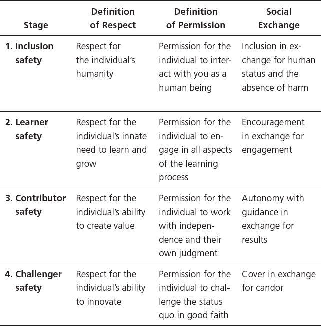

**Psychological Safety** is the single most important factor in explaining high performance.
> People flourish when they’re participating in a cooperative system with high psychological safety.

When psychological safety is high, people:
+ Take more ownership  
+ Release more discretionary effort
+ Learn more quickly 
+ Solve problems faster

> The presence of fear in an organization is the first sign of weak leadership.

Progression of Psychological Safety
1. *Inclusion Safety*
2. *Learner Safety*
3. *Contributor Safety*
4. *Challenger Safety*

### How to gain Psychological Safety

1. Love yourself first. Give yourself inclusion safety
2. Find and connect with trustworthy, happy people who genuinely want your success and are willing to help.
3. If you feel dominated, controlled, or trapped, with no apparent means of escape, search for a way out or leave immediately. 
4. Refuse to entertain damaging thoughts about yourself.

----

🍵 **Inclusion safety** is when someone is destigmatized as an outsider and brought into the fold.

Inclusion safety is created and sustained through renewed admittance to the group and repeated indications of acceptance.

What should it take to qualify for inclusion safety?
1. Be human
2. Be harmless

### How to give Inclusion Safety

1. Understand their cultural background.
2. Trust the person.
3. Validate the person. Boost their self-esteem.
4. Increase your own self-worth.
5. Interact with the person often to get to know them better, and vice versa.

*As you love people with action, you come to love them with emotion.*

----

🍎 **Learner safety** is when you feel safe to engage in the discovery process, ask questions, experiment, and even make mistakes. In an ideal setting, learner safety is a mutual giving and receiving of ideas, observations, questions, and discussion. 

Learner safety requires low ego and uncommonly high emotional intelligence.

Where learner safety exists, the leader creates a learning process with low social friction and low emotional expense.

 ### How to give Learner Safety

 1. Support the person's learning process.
 2. Set learning goals that match the learner's skill level, or are even a bit higher.
 3. Reiterate that it's okay, and even expected, to make mistakes. Encourage them during times of failure.
 4. Be patient and avoid judgment.
 5. Model effective learning. Become comfortable portraying yourself as competent through your ability to learn and adapt rather than your expertise.
 6. Provide the resources needed to learn, such as materials and time.
 7. Be in constant conversation so you get to know each other better. If you lose emotional engagement, intellectual engagement slows down or may not happen at all. 
 8. Manage those who learn with their mouths—the vocally aggressive members of your team.
 9. Never let hierarchy relieve anyone of the responsibility to learn

*Learning is where competitive advantage comes from.*

----

🔧 **Contributor safety** emerges when the individual performs well, but the leader and team must do their part to provide encouragement and appropriate autonomy.

With contributor safety, the organization assumes risk on behalf of the individual.

When you’re competent and willing to hold yourself accountable, you’re ready to receive contributor safety.

The Three Levels of Accountability
3. *Outcome*
2. *Process*
1. *Task*

When a person grants contributor safety in a way that tends to release discretionary effort, we call that the **blue zone**.

### How to give Contributor Safety

1. Invest in support, guidance and direction into people. But no handholding, no coddling, and most importantly, no shortcuts.
2. Gradually provide autonomy in exchange for performance to manage risk.
3. Nip toxic behaviors from the bud (mean-spirited comments, unethical behavior, abuse, and bullying). A toxic environment shuts down performance because people worry about psychological safety before they worry about performance.
4. Manage your ego.
5. Ask, rather than tell. A leader’s tell-to-ask ratio shapes the signal-to-noise ratio for the team. If the leader is telling all the time, that telling becomes noise.
7. Listen first, talk last.
8.  Recognize the difference between dissenting and derailing behavior and manage the boundary between the two.

----

🌩️ **Challenger Safety** is a license to innovate, the confidence to speak truth to power when you think something needs to change and it’s time to say so. 

Where there is no tolerance for candor, there is no constructive dissent. Where there is no constructive dissent, there is no innovation.

To innovate:
1. Increase intellectual friction 
2. Decrease social friction.
3. Seek out differences. 
2. Reduce the risk of ridicule.

### How to give Challenger Safety and promote Innovation

1. Encourage dialogue and emotionally tolerate dissent along the way. When it comes to innovation, connectivity increases productivity.
2. Provide candor for cover. This means that you as the leader protect each person’s right to speak candidly about any topic, provided they don’t make personal attacks or have malicious intent.
3. Increase transparency. The more unknowns the leader eliminates through transparency, the fewer sources of stress the employee worries about.
4. Welcome questions. No off-limits topics.
5. Don’t make it emotionally expensive to challenge the status quo. Ask the members of your team to challenge specific things and discuss ideas on merit.
6. Make your talk-to-listen ratio 50-50.
7. Give every member of your team the duty to disagree. Then brace yourself to hear the truth.
8. Sponsor and protect rather than snare and disinfect ideas coming from every direction.
9.  Give credit where due. When a leader personally replaces the search for innovation with rivalry for prominence, the team can’t achieve the social cohesion necessary for the cocreative process of innovation.
10. Have everyone on your team take turns leading your regular meetings.
11. Ensure that less experienced and lower-status individuals have the opportunity to train more experienced, higher-status individuals.
12. If you reject a team member’s suggestion, show sensitivity by explaining why

The pattern of innovation is to try a lot and triumph a little.

**Increasingly we will not look upon our leaders as having the answers; we will look upon them as those who can draw out those answers by tapping the creative potential of the organization.**

----

to innovate
> increase intellectual friction and
>  decrease social friction.

fear is the enemy
- freezes initiative, 
- ties up creativity, 
- yields compliance instead of commitment

*The presence of fear in an organization is the first sign of weak leadership.*

Progression of psychological safety
1. Inclusion safety
2. Learner safety
3. Contributor safety
4. Challenger safety

Psychological safety is a condition in which you feel 
+ included, 
+ safe to learn, 
+ safe to contribute, and 
+ safe to challenge the status quo—
> all without fear of being embarrassed, marginalized, or punished in some way.
> psychological safety straddles fulfillment, belonging, and security needs

treat human beings as they deserve to be treated—without arbitrary distinctions

**how we feel influences what we think and do.**

psychological safety  as the single most important factor in explaining high performance

psychological safety is high, 
+ people take more ownership and 
+ release more discretionary effort, resulting in 
+ higher-velocity learning and 
+ problem solving.

An organization that expects employees to bring their whole selves to work should engage the whole employee.

As organizations grant increasing levels of respect and permission, individuals generally behave in a way that reflects the level of psychological safety offered to them.

People flourish when they’re participating in a cooperative system with high psychological safety.

## Inclusion safety
> the members of the social collective accept you and grant you a shared identity.
> destigmatized as an outsider and brought into the fold.
> The need to be accepted precedes the need to be heard.

Being ignored is often as painful as being rejected.

Inclusion safety is created and sustained through renewed admittance to the group and repeated indications of acceptance.

Giving inclusion safety is a moral imperative. 

If there’s no psychological safety, there’s no inclusion.

Including another human being should be an act of prejudgment based on that person’s worth, not an act of judgment based on that person’s worthiness.

create an environment of inclusion before we begin to think about judgments at all.

The only reciprocation requirement in this unwritten social contract is the mutual exchange of respect and permission to belong. 

What should it take to qualify for inclusion safety? Two things: 
1. Be human
2. Be harmless.

To create inclusion safety, it helps to understand cultural differences, but you don’t need to be an expert in those differences, just sensitive to and appreciative of them.

key drivers of psychological safety include familiarity among team members and the quality of those relationships based on prior interactions.

Inclusion safety is not earned but owed. 

if you’re a leader and want your people to perform, you must internalize the universal truth that people want, need, and deserve validation.

the faster and deeper you get to know each other, the more effectively you can work together.

More contact and context tend to create more empathy.

In any social unit, inclusion safety can be granted, withheld, revoked, or  partially or conditionally granted.

Where there’s no trust, there’s exclusion.

because of our insecurity we refuse to validate each other, which is the very thing that heals the insecurity.

Excluding a person is more often the result of personal unmet needs and insecurities than a genuine dislike of the person.

People with low self-regard have a hard time being inclusive. 
> Research shows that a well-developed sense of personal value and autonomy correlates significantly with kindness, generosity, social cooperation, and a spirit of mutual aid.
> to develop self-regard is to develop your own capacity and confidence and to perform acts of service for others, especially for those whom you struggle to include.
> Make it experiential by creating diverse teams and assigning individuals to diverse mentoring or peer coaching relationships.

As you love people with action, you come to love them with emotion.

## Learner Safety
> Learner safety indicates that you feel safe to engage in the discovery process, ask questions, experiment, and even make mistakes—not if, but when, you make them.

When the environment belittles, demeans, or harshly corrects people in the learning process, learner safety is destroyed.

 three patterns of fear-inducing emotional danger
 1. neglect - schools
 2. manipulation - work 
 3. coercion - work
    * Fear comes as a result of ridicule, bullying, harassment, threats, and intimidation.

the unsafe workplace is most likely a refuge of ridicule.

When the environment punishes rather than teaches, whether through neglect, manipulation, or coercion, individuals become more defensive, less reflective, and less able to self-diagnose, self-coach, and self-correct. That introduces the risk of real failure—the failure to keep trying.

Where learner safety exists, the leader creates a learning process with low social friction and low emotional expense.

 If I’m giving learner safety to an individual, I want and expect the individual to make an effort to learn. If I’m the learner, I expect the leader, teacher, coach, or parent to support me in the learning process.

 we can’t expect the learners to initiate the effort to learn when experience may have taught them that the risk is too great.

 We need to remind ourselves that we don’t command learning, we invite it. 

 In an ideal setting, learner safety is a mutual giving and receiving of ideas, observations, questions, and discussion. 

 We commit to be patient with learners. We commit to model effective learning, and we commit to share power, credit, and resources to enable all to learn.

 That ability to resist making discriminating judgments of students’ abilities is a skill, but it’s also a moral capacity

 Expectations shape behavior in both directions. When you set the bar high or low, people tend to jump high or low.

 I can’t teach students unless I like them. I can’t like them unless I know them, and I can’t know them unless I talk to them.

 Failure isn’t the exception, it’s the expectation and the way forward. There will be discouragement before discovery.

Learner safety requires low ego and uncommonly high emotional intelligence.

A person’s ability to learn requires staying focused, managing impulses, and avoiding distractions.

If you lose emotional engagement, intellectual engagement slows down or may not happen at all. People learn from the people they love more than from the people they don’t.

Humans learn in context, not in isolation
> When the learning context is encouraging, it taps the drive to be curious. 

Grit alone will not close a learning gap. Learner safety is essential.

Either learn and retool to maintain competitiveness or face the grave risk of irrelevance.

an organization as a “system of learning as well as production.”

Leaders must become comfortable portraying themselves as competent through their ability to learn and adapt rather than their expertise.

to cultivate and preserve learner safety:
1. manage those who learn with their mouths—the vocally aggressive members of your team
2. never let hierarchy relieve anyone of the responsibility to learn

Leaders committed to safeguard learner safety understand that learning is where competitive advantage comes from

## Contributor Safety
> Contributor safety is an invitation and an expectation to perform work in an assigned role with appropriate boundaries, on the assumption that you can perform competently in your role.
+ Contributor safety emerges when the individual performs well, but the leader and team must do their part to provide encouragement and appropriate autonomy.

provide autonomy in exchange for performance.
> We will empower you if you can deliver results.

Contributor safety marks the end of the apprenticeship and the beginning of solid, self-directed performance.

the individual invests effort and skill, and the team invests support, guidance, and direction.

 The preparation to perform creates the desire to perform.

The organization is expecting you to carry your load and perform competently.

Organizations engage in only two processes— execution and innovation. Execution is the creation and delivery of value today, while innovation is the creation and delivery of value tomorrow.

Execution is about economizing work and scaling processes.
Innovation is the opposite. It’s about freedom, imagination, creativity, and the introduction of variability. 

Offensive innovation is proactive, while defensive innovation is reactive.
Offensive innovation is a response to an opportunity, while defensive innovation is a response to a threat or crisis.

 The reason defensive innovation is part of contributor safety is that it’s riskier to do nothing than to formulate a response.
>  You seldom feel threatened internally when you’re threatened externally.

The social contract for the third stage of contributor safety trades autonomy for performance.

The social unit grants the individual increased independence and ownership—both know-how and reliability.

When you’re competent and willing to hold yourself accountable, you’re ready to receive contributor safety.

With contributor safety, the organization assumes risk on behalf of the individual, who is expected to contribute.
> We do it gradually based on performance to manage risk along the way.

The Three Levels of Accountability
3. Outcome
2. Process
1. Task

There was guidance, but no handholding, no coddling, and most importantly, no shortcuts.

1. Motivation: Your desire to act
2. Volition: Your power to choose and act for yourself
3. Cognition: The mental process of learning 
4. Emotion: Your state of feeling
5. Apprehension: The state of being conscious or aware of yourself

When a person restricts contributor safety in a way that causes us to freeze our discretionary efforts due to fear and the potential of social and emotional harm, we call that a red zone

 Fear-stricken teams give you their hands, some of their head, and none of their heart.

 produce outstanding results in exchange for autonomy, guidance, and support.

 Don’t excuse yourself from the obligation of creating contributor safety because you think you may not possess certain gifts of personality.

 The reality is that whether you’re in a leadership role or an individual contributor role, you have the responsibility to help create contributor safety for the team. Ask yourself if you are emotionally prepared to do it.

 A toxic environment is one in which employees are motivated by personal gain to the point that they engage in mean-spirited comments, unethical behavior, abuse, and bullying.

A toxic environment shuts down performance because people worry about psychological safety before they worry about performance.

Contributor safety results when the individual can contribute, and the leader and team members are able to manage their egos.

To foster the high level of contributor safety needed for a blue zone, you must get to know the members of your team.
> If you want to foster a blue zone of contributor safety, create a truly collaborative environment.

Leaders spend most of their time engaged in inquiry and advocacy.

Track yourself for a day or so and figure out how much of the time you’re telling versus asking. 
> Telling is efficient, but it quickly moves the listener into a passive mode and can slow down learning.

A leader’s tell-to-ask ratio shapes the signal-to-noise ratio for the team. If the leader is telling all the time, that telling becomes noise.

Speaking first when you hold positional power softly censors your team.

to engender contributor safety, help the members of your team think beyond their individual roles.
> requires that we have both the skill and the will to make that bigger contribution.

Before people can get out of their tactical and functional siloes to think strategically, they must be liberated by the contributor safety you give them.

The invitation to think beyond one’s role expresses greater respect for the individual and grants greater permission to contribute.

It’s the leader’s job to recognize the difference between dissenting and derailing behavior and to manage the boundary between the two.
> Those who dissent constructively are guided by a sense of self-awareness and pure intent.

## Challenger Safety
> Challenger safety is a license to innovate.
> the confidence to speak truth to power when you think something needs to change and it’s time to say so.
> a level of psychological safety so high that people feel empowered to challenge the status quo

Only when people feel free and able do they apply their creativity.

If you conduct a postmortem analysis of failure for almost any commercial organization that dies, you can trace the cause of death to a lack of challenger safety.

Where there is no tolerance for candor, there is no constructive dissent. Where there is no constructive dissent, there is no innovation.

To scale innovation throughout the organization, leaders must establish a norm of challenging the status quo.

Challenger safety democratizes innovation.
> When it comes to innovation, connectivity increases productivity.

encourage dialogue and emotionally tolerate dissent along the way

To socialize a team with challenger safety from the beginning is always easier than to re-socialize a team later.

Organizational change is a process that moves through three separate layers:
1. technical:  artifacts ; include systems, processes, structures, roles, responsibilities, policies, procedures, and tools and technology
2. behavioral: change the way people behave as they interact with the technical layer and each other in new ways. 
   * artifacts hold up behavior, they act as scaffolding. 
   * once the scaffolding is removed, behavior reverts to past patterns
3. cultural: the invisible layer, consisting of values, beliefs, and assumptions.
   * single most difficult thing to change and the layer that changes last

the “innovation threshold”—a place where the highest possible level of psychological safety replaces what would normally be a place inhabited with the greatest fear.

you can’t coerce or manipulate innovation. The process is surrounded by political and interpersonal risk. 

Innovation is hard enough because there’s no safety from failure.
> what the leader can do is take the social sting and emotional bite out of the process.

 the reality is that you’re asking your people to expose themselves to criticism, risk failure, take chances, be vulnerable, not fit in, and feel pain. And you’re asking them to do all of this without any real control of the outcome.

 Candor-for-cover means that you as the leader protect each person’s right to speak candidly about any topic, provided they don’t make personal attacks or have malicious intent.

In an atmosphere of challenger safety, we take all comers and all contributions.

The more unknowns the leader eliminates through transparency, the fewer sources of stress the employee worries about.

It’s possible to unlock creativity in a crisis if the leader welcomes dissent and doesn’t add a layer of manufactured fear to the existing level of natural stress.

In the process of innovation, learning is more important than knowing.

The Two Types of Innovation
TYPE 1
* Incremental
* Derivative

TYPE 2
* Radical
* Disruptive

Innovation is the process of connected people connecting things.

Asking questions introduces personal risk.
> From a career standpoint, this is the high-risk, high-reward zone.

the line between brilliance and ignorance can be very thin. 

1. there were no dumb questions.
2. there were no questions that were off limits, no topics that we couldn’t talk about
3. model this behavior as a leader
4. talk-to-listen ratio should be 50-50

Your success will depend, not on independent action, but on your dependent interaction.

Your job as a leader is to reduce social friction while increasing intellectual friction.

The pattern of innovation is to try a lot and triumph a little.

To get innovation to flow:
1. seek out differences. 
2. reduce the risk of ridicule.

Disagreement is needed to stimulate the imagination.

create a theater of conflict that carries natural pressure and stress, but not fear.

Simply knowing that your vulnerability will not be exploited encourages you to be brave and contribute to the generative process.

The challenge with challenger safety is that it takes time to create and no time destroy.

leaders: your primary role is to sponsor and protect rather than snare and disinfect ideas coming from every direction.

When a leader personally replaces the search for innovation with rivalry for prominence, the team can’t achieve the social cohesion necessary for the cocreative process of innovation.

You must be humble and open, and you must listen, and if you don’t, the people around you will eventually have nothing to say. 

**Increasingly we will not look upon our leaders as having the answers; we will look upon them as those who can draw out those answers by tapping the creative potential of the organization.**

Make your organization culturally flat even though it’s not structurally flat. Make it egalitarian. 
1. have everyone on your team take turns conducting your regular meetings.
2. conduct a short training segment each week. rotate the responsibility to lead the training.
3. Ensure that less experienced and lower-status individuals have the opportunity to train more experienced, higher-status individuals.
4. during 1:1s - go to them rather than have them come to you. 

success may not be your friend when it comes to nurturing challenger safety. 

leaders: you must formally and officially assign dissent.
> you’re formally commissioning and officially dedicating resources to vet ideas and tell you why something might not work, where it’s weak, why it’s flawed.

 Assigning dissent to a project, priority, or initiative from the beginning removes the natural fear normally associated with challenging the status quo.

 assigning dissent is the single most effective mechanism available to a leader to shift a culture toward agility.

  Though it may appear personally threatening, leaders must stand first in line to model the patterns of learning agility.

  Leaders will increasingly earn competence through their ability to learn and adapt rather than depending on their current knowledge and skills.

  * Know that you are the curator of culture. 
  * Call anyone out that tries to silence others.
  * Display no pride of authorship.
  * Give every member of your team the duty to disagree. Then brace yourself to hear the truth.
  * Don’t make it emotionally expensive to challenge the status quo. Ask the members of your team to challenge specific things and discuss ideas on merit.
  * The process is messy, iterative, and nonlinear, and there may be some pivots along the way. Point out that you’re in uncharted territory, and help your team enjoy the journey.
  *  If you reject a team member’s suggestion, show sensitivity by explaining why

## Avoiding Paternalism and Exploitation

### Paternalism
When a team offers a measure of respect, but very little permission, it falls into the gutter of **paternalism**. 
> Paternalism is telling you what to do, supposedly in your own best interest.
> Paternalistic leaders act like helicopter parents and benevolent dictators
> paternalism breeds cynicism and disengagement
> Paternalism’s lack of permission creates the fear of social isolation.
* You seek comfort more than freedom, security more than independence.

The power of paternalism is often good and necessary. It protects us until we are wise enough to protect ourselves.

*Unnecessary paternalism runs the risk of breeding dependency and learned helplessness on the one hand and frustration and rebellion on the other.*

Paternalism is safe in the short term but grows dangerous in the long term.
> Over time, paternalism leads to a low tolerance for candor and a lack of bravery.

In most paternalistic societies, there’s strong deference to authority and a desire to honor the past.

### Exploitation

Exploitation combines high permission with low respect. It tends to be motivated by the universal temptation toward despotism—the urge to control others for gain and gratification.
> Exploitation is the process of extracting value from another human being while disregarding that person’s inherent value.

Whether personal or organizational, exploitation requires some

type of repressive apparatus by which to extract value from humans, either by manipulation or coercion.

**exploitation’s** lack of respect creates the fear of harm in addition to the fear of isolation.

permission to contribute, but little respect >> exploitation

act in the role of social architect and nourish a context in which people are given the respect and permission to (1) feel included, (2) learn, (3) contribute, and (4) innovate.

When exploitation is permitted, people learn to accept it without complaint. Even those who are exploited can become defenders of the very exploitation they suffer.

----

Social approval, belonging, and connectedness are needs. But no one really needs constant validation.

When necessary, healthy rejection of popular opinion is a beautiful thing.

In the land of false fellowship, unnatural competition replaces natural affection.

Nobody is a nobody. 

Whether or not you’re accepted, you’re acceptable.

* Love yourself first. Give yourself inclusion safety
* If you observe others acting maliciously toward you, even if it’s mild, act early to confront the behavior or remove yourself from the situation.
* Don’t believe that you must accept abusive treatment.
* As you work to liberate yourself from unhealthy treatment, fight back in healthy ways. 
* Avoid drugs and all forms of self-harm and self-indulgence.
* If you feel dominated, controlled, or trapped, with no apparent means of escape, search for a way out or leave immediately. 
* refuse to entertain damaging thoughts about yourself.
* Find and connect with trustworthy, happy people who genuinely want your success and are willing to help.

Psychological safety is built on a moral foundation of looking on our fellow creatures with respect and giving them permission to belong and contribute.

If you make any excuse for not extending psychological safety, you’re choosing to value something else more than human beings.

The clearest message that we get from this 75-year study is this: Good relationships keep us happier and healthier.

The greatest source of fulfillment in life comes from including others, helping them learn and grow, unleashing their potential, and finding deep communion together.