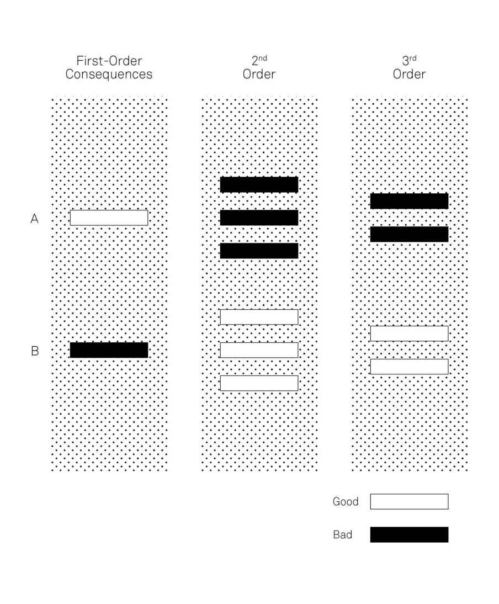

Recommended Videos:
- https://www.youtube.com/watch?v=ywyQ_eNNCJU&list=PLI84Sf0aDgazRojpYTLTXFE6Iaf5bkYr_

## The Map is not the Territory

Maps are:
- reductions of what they represent
- a snapshot of a point in time
- subjective to the author's point of view

> the only way we can navigate the complexity of reality is through some sort of abstraction

if the aim becomes simplification rather than understanding we start to make bad decisions.

They are guidebooks, not laws.

1. Reality is the ultimate update.
> If reality has changed, the map must change.
> The faster the rate of change in the territory, the harder it will be for a map to keep up to date.
2. Consider the cartographer.
> Maps are not purely objective creations. They reflect the values, standards, and limitations of their creators.
> Models, then, are most useful when we consider them in the context they were created.
3. Maps can influence territories.
> As more and more people know what model you’re using to manipulate them, they may decide not to respond to your incentives.

----

## Circle of Competence

Understanding your circle of competence improves decision-making and outcomes.

In circle of competence:
* likely have more than one solution to every problem
* eliminate bad choices quickly because he has all the pieces of the puzzle
* make decisions quickly and relatively accurately.
* know what is knowable and what is unknowable and can distinguish between the two.

Building a circle of competence takes years of experience, of making mistakes, and of actively seeking out better methods of practice and thought.

To maintain the circle:
1. curiosity and a desire to learn. Learning comes when experience meets reflection.
2. self-reporting. monitor honestly so the feedback can be used to your advantage. 
   * Keeping a journal of your own performance is the easiest and most private way to give self-feedback. 
3. external feedback. 

Coaching benefit
- receive something you couldn’t see himself and something no one else would point out: knowledge of where his skill and technique was suboptimal.
- ability to provide better feedback to other doctors.

if defensiveness starts to manifest, focus on the result you hope to achieve.

successfully operating outside a circle of competence
1. Learn at least the basics
2. Talk to someone whose circle of competence in the area is strong.
   * Ask thoughtful questions
3. Use a broad understanding of the basic mental models to augment your limited understanding

### Falsifiability

Falsification is the opposite of verification
> you must try to show the theory is incorrect, and if you fail to do so, you actually strengthen it.

Applying the filter of falsifiability helps us sort through which theories are more robust.

----

## First Principles Thinking

* a tool to help clarify complicated problems by separating the underlying ideas or facts from any assumptions based on them
* Reasoning from first principles allows us to step outside of history and conventional wisdom and see what is possible.

### Techniques for establishing first principles

**Socratic questioning**
> a disciplined questioning process, used to establish truths, reveal underlying assumptions, and separate knowledge from ignorance.
1. Clarifying your thinking and explaining the origins of your ideas.
2. Challenging assumptions.
3. Looking for evidence.
4. Considering alternative perspectives.
5. Examining consequences and implications.
6. Questioning the original questions.

**the Five Whys**
> it is about systematically delving further into a statement or concept so that you can separate reliable knowledge from assumption.
> The goal of the Five Whys is to land on a “what” or “how”.
+ If your “whys” result in a statement of falsifiable fact, you have hit a first principle. 
- If they end up with a “because I said so” or ”it just is”, you know you have landed on an assumption

To improve something, we need to understand why it is successful or not. Otherwise, we are just copying thoughts or behaviors without understanding why they worked. 

The real power of first principles thinking is moving away from random change and into choices that have a real possibility of success.

----

## Thought Experiment
> Thought experiments tell you about the limits of what you know and the limits of what you should attempt.
> lets us do things in our heads we cannot do in real life

use thought experiment to reduce the role of chance in decisions.

Steps
1. Ask a question
2. Conduct background research
3. Construct hypothesis
4. Test with (thought) experiments
5. Analyze outcomes and draw conclusions
6. Compare to hypothesis and adjust accordingly (new question, etc.)

Where to use:
* Imagining physical impossibilities
* Re-imagining history
* Intuiting the non-intuitive
* explore ethical and moral issues

But we can use thought experiments to explore unrealized outcomes—to re-run a process as many times as we like to see what could have occurred, and learn more about the limits we have to work with.

### Necessity and Sufficiency

the gap between what is necessary to succeed and what is sufficient is often luck, chance, or some other factor beyond your direct control.

The set of conditions necessary to become successful is a part of the set that is sufficient to become successful. But the sufficient set itself is far larger than the necessary set.

----

## Second-Order Thinking

Second-order thinking is thinking farther ahead and thinking holistically.
> It requires us to not only consider our actions and their immediate consequences, but the subsequent effects of those actions as well.
> Second-order thinking needs to evaluate the most likely effects and their most likely consequences, checking our understanding of what the typical results of our actions will be.

Law of Unintended Consequences
> the second level of effects is not considered until it’s too late.

High degrees of connections make second-order thinking all the more critical, because denser webs of relationships make it easier for actions to have far-reaching consequences.

How often is short-term gain worth protracted long-term pain?

two areas where second-order thinking can be used to great benefit:
1. Prioritizing long-term interests over immediate gains
   * Going for the immediate payoff in our interactions with people, unless they are a win-win, almost always guarantees that interaction will be a one-off.
   * the short term is less spectacular, but the payoffs for the long term can be enormous.
2. Constructing effective arguments
   * Arguments are more effective when we demonstrate that we have considered the second-order effects and put effort into verifying that these are desirable as well.
   * You can’t let it lead to the paralysis of the Slippery Slope Effect, the idea that if we start with action A, everything after is a slippery slope down to hell, with a chain of consequences B, C, D, E, and F.

----

## Probabilistic thinking

Probabilistic thinking is essentially trying to estimate, using some tools of math and logic, the likelihood of any specific outcome coming to pass.

1. roughly identifying what matters
2. coming up with a sense of the odds
3. doing a check on our assumptions
4. making a decision

**Bayesian thinking**
the likelihood ratio or the Bayes factor
> taking in outside information about past situations like the one you’re in
> priors themselves are probability estimates
> using conditional probability means being very careful to observe the conditions preceding an event you’d like to understand.

**Fat-tailed curves**
Common outcomes cluster together, creating a wave.
> we can’t rely on the most common outcomes as representing the average

**Asymmetries**
> the probability that your probability estimates themselves are any good.

IMPT!!
any small error in measuring the risk of an extreme event can mean we’re not just slightly off, but way off—off by orders of magnitude

upside optionality
> seeking out situations that we expect have good odds of offering us opportunities
> The worst thing that can happen is...nothing

learn how to fail properly
> never take a risk that will do you in completely
> develop the personal resilience to learn from your failures and start again

try to create scenarios where randomness and uncertainty are your friends, not your enemies.

probability estimates are wrong on the “over-optimistic” side than the “under-optimistic” side

### Causation vs. Correlation

Trying to invert the relationship can help you sort through claims to determine if you are dealing with true causation or just correlation.

Whenever correlation is imperfect, extremes will soften over time
> the best will always appear to get worse and the worst will appear to get better,

We often mistakenly attribute a specific policy or treatment as the cause of an effect, when the change in the extreme groups would have happened anyway.
> Solution: control groups.

----

## Inversion

Instead of thinking through the achievement of a positive outcome, we could ask ourselves how we might achieve a terrible outcome, and let that guide our decision-making

approaching a situation from the opposite end of the natural starting point
> it can be more useful to start at the end.
> Avoiding stupidity is easier than seeking brilliance

1. Start by assuming that what you’re trying to prove is either true or false, then show what else would have to be true.
2. Instead of aiming directly for your goal, think deeply about what you want to avoid and then see what options are left over.

1. Identify the problem
2. Define your objective
3. Identify the forces that support change towards your objective
4. Identify the forces that impede change towards the objective
5. Strategize a solution! This may involve both augmenting or adding to the forces in step 3, and reducing or eliminating the forces in step 4.

